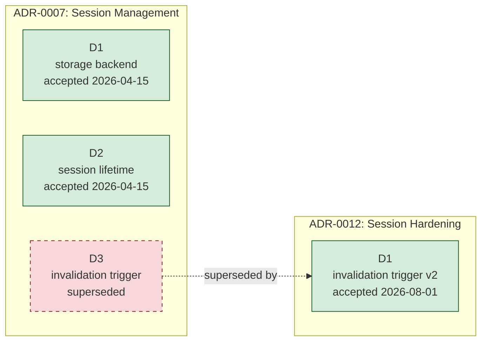
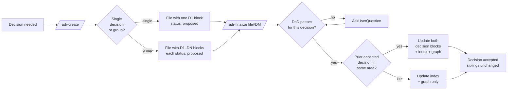

# Architectural Decision Records

This directory is this project's **Architecture Decision Log (ADL)** — the collection of every Architectural Decision Record (ADR) made. Each ADR file is a **Decision Group**: one or more architecturally significant decisions that share context and are documented together for readability. **Each individual decision tracks its own status**, can be proposed, accepted, superseded, or deprecated **independently** of its siblings.

ADRs are managed via two slash commands:

| Command | Purpose |
|---------|---------|
| `/adr-create <topic>` | Draft a new ADR file containing 1+ proposed decisions |
| `/adr-finalize <file>#<decision>` | Resolve open questions for a single decision, flip it to `accepted`, and apply per-decision supersession |

---

## Glossary

| Term | Definition |
|------|------------|
| **AD** (Architectural Decision) | A justified design choice that addresses a functional or non-functional requirement that is architecturally significant |
| **ASR** (Architecturally Significant Requirement) | A requirement with measurable effect on system structure, key quality attributes, or external dependencies |
| **ADR** (Architectural Decision Record) | A single file documenting one **Decision Group** of related ADs |
| **Decision Group** | The set of decisions captured in one ADR file. Group members share context but each has independent status |
| **Decision** (`ADR-NNNN#DM`) | A single AD inside a Decision Group, addressed by file number `NNNN` and intra-file sequence `DM` (`D1`, `D2`, …) |
| **ADL** (Architecture Decision Log) | The collection of all ADRs for this project — *i.e.* this directory |
| **Decision Area** | The scope a single decision addresses (e.g. "session-storage", "api-style"). Lives on the decision's `Tags`. Used for supersession matching |
| **Supersession** | The act of replacing a prior `accepted` decision (`ADR-NNNN#DM`) with a new one (in the same or a different file). The unit of supersession is the **decision**, never the file |

---

## When to Write an ADR

Write an ADR — i.e. start a new Decision Group — when at least one decision in the topic is **architecturally significant**:

| Category | Examples |
|----------|----------|
| **Structure** | Module boundaries, layering, monorepo vs polyrepo, service decomposition |
| **Non-functional characteristics** | Performance, scalability, security, observability, resilience |
| **Dependencies** | Major library/framework choice, runtime, database, message broker |
| **Interfaces** | API style (REST/GraphQL/gRPC), event schema, public contracts |
| **Construction techniques** | Build tooling, test strategy, deploy model, branching strategy |
| **Hard-to-reverse choices** | Anything difficult or expensive to undo later |

## When NOT to Write an ADR

| Category | Why skip |
|----------|----------|
| Bug fixes | Rationale belongs in the commit message |
| Behavior-preserving refactors | No decision to record |
| Variable / function naming | Style, not architecture |
| UI styling tweaks | Below the architectural threshold |
| Easily reversible choices | Cost of recording exceeds value |
| Single-engineer choices that don't need coordination | No agreement needed |

If the topic does not clear the bar in either table above, do not pad the ADL — close the question in the PR description or a code comment.

---

## When to Group Decisions vs Split into Separate Files

Decision Groups exist to keep **shared context** in one place. Use this triage:

| Signal | Group into one file | Split into separate files |
|--------|--------------------|--------------------------|
| Shared context (problem statement, drivers) | ✅ Group — re-stating context for each decision is wasteful | — |
| Same deciders | ✅ Group | — |
| Tightly coupled (one decision constrains the next) | ✅ Group | — |
| Different decision areas with little overlap | — | ✅ Split |
| Different audiences / reviewers | — | ✅ Split |
| Different timelines (one decision is urgent, another can wait) | — | ✅ Split |
| One decision is much larger than the others | — | ✅ Split — bloat hurts readability |
| Likely to be superseded at very different times | Acceptable to group (per-decision supersession handles it) | Also acceptable to split |

**When in doubt, split.** It is cheaper to merge two related ADRs into a future Decision Group than to untangle a fat ADR whose decisions need separate evolution.

---

## How Decisions Relate to Each Other

The unit of relationship is the **decision**, not the file. Two decisions are related when they cover the same **decision area** (matched via `Tags`, then slug stem of decision sub-title, then user confirmation).

### The supersession rule (mandatory)

| Situation | Required Action |
|-----------|-----------------|
| New decision finalized in a **new** decision area | No supersession; decision stands alone |
| New decision finalized in an **existing** decision area with a prior `accepted` decision (in any file) | The new decision **must** supersede the prior one. Both decision blocks are cross-referenced. |
| Multiple prior accepted decisions in the same area | New decision supersedes the most recently accepted one in that chain |

`/adr-finalize` enforces this rule per decision. It searches across **all ADR files** for prior `accepted` decisions sharing the new decision's tags; if any are found, finalization is blocked unless the user confirms the supersession or declares a different decision area.

### The two-block cross-reference rule (mandatory)

When `ADR-N#DX` supersedes `ADR-M#DY`, **both decision blocks must be updated atomically**:

| Site | Required Change |
|------|-----------------|
| **New decision block** (`ADR-N#DX`) — the superseder | `Supersedes: ADR-M#DY` line in the decision's metadata; the decision's `## Links` includes `Supersedes [ADR-M#DY](MMMM-slug.md#dY-...)` |
| **Old decision block** (`ADR-M#DY`) — the superseded | `Status` flips from `accepted` to `superseded by ADR-N#DX`; a callout is inserted directly under the decision's heading: `> **Superseded by [ADR-N#DX](NNNN-slug.md#dX-...)** on YYYY-MM-DD` |
| **The index** | Both rows updated: M's `Status` becomes `superseded by ADR-N#DX`; N's `Supersedes` cell points to `ADR-M#DY` |
| **Relationship graph** | New node added; edge drawn from M's node to N's node labelled with the date; M's class flipped to `superseded` |

**Crucial:** The superseded decision's *siblings* in `ADR-M` are untouched — they keep their own status. Only the affected block changes. If `ADR-0007` contains D1 (accepted), D2 (accepted), D3 (accepted) and a new ADR supersedes only D2, then D1 and D3 remain `accepted` in `ADR-0007` while D2 is marked `superseded by ADR-0012#D1`.

### Why supersede instead of edit

Accepted decisions are **immutable history**. The only edits permitted to an accepted decision block are:

| Permitted Edit | Trigger |
|----------------|---------|
| `Status` flip to `superseded by ADR-N#DX` or `deprecated` | A successor decision is finalized, or the decision becomes irrelevant |
| Top-of-block supersession callout | Same as above |

To change the substance of a past decision, write a new decision (in a new ADR file or as a new `D*` block in a related-context file) and finalize it. The chain is the audit trail.

---

## Decision Area Identification

`/adr-finalize` determines whether two decisions share an area by checking, in this order:

| Tier | Signal | Weight |
|------|--------|--------|
| 1 | Tag overlap on the **decision blocks** (≥ 1 shared tag) | Strongest |
| 2 | Decision sub-title noun-phrase overlap | Strong |
| 3 | File slug stem overlap (only when both decisions are the sole `D1` of a single-decision file) | Medium — weaker than in single-decision model |
| 4 | Explicit `Supersedes:` already set in the decision metadata | Authoritative |
| 5 | User confirmation when automatic detection is ambiguous | Final |

**Tag aggressively per decision.** Because each decision in a group may live in a different decision area, file-level conventions are not enough — every decision block must carry its own `Tags` line. `/adr-create` enforces non-empty `Tags` on every decision block.

---

## Definition of Done (E-C-A-D-R) — applied per decision

Before flipping a single decision's status from `proposed` to `accepted`, all five criteria must be satisfied **for that decision**. A file may have one decision that meets DoD and another that doesn't — the first can be finalized while the second stays proposed.

| # | Criterion | What it means | Where it shows up in the decision block |
|---|-----------|---------------|-----------------------------------------|
| **E** | **Evidence** | Grounded in real research — code reading, library docs, prior ADRs, prototypes | `### Context` cites concrete sources |
| **C** | **Criteria & alternatives** | At least two viable options assessed against explicit drivers | `### Decision Drivers` and `### Considered Options` are non-empty; comparison matrix has no empty cells |
| **A** | **Agreement** | The decision's named deciders have explicitly ratified the chosen option | `Deciders` metadata is filled; `### Decision Outcome` names the chosen option in bold |
| **D** | **Documentation** | The decision block is complete: no placeholders, no TBDs, no asymmetric tables, no bullet-list comparisons | `/adr-finalize` audit passes |
| **R** | **Realization & review plan** | The decision states how/when its outcome will be verified and revisited | `### Validation` has at least one measurable signal with threshold and timeframe |

If any criterion fails, leave that decision's status as `proposed` and resolve the gap. Faking acceptance to close a ticket is the worst-case anti-pattern — it makes the entire ADL untrustworthy.

---

## File Structure

Each ADR file has **file-level front matter** and one **decision block per decision**. The shape:

```markdown
# ADR NNNN: <Decision-Group Title>

> Decision Group covering <area-1>, <area-2>, <area-3>.

- **File created**: YYYY-MM-DD
- **Last updated**: YYYY-MM-DD
- **Tags (group)**: <umbrella tags shared by all decisions, optional>

## Shared Context

<Context that applies to every decision in this group. Avoid restating in each block.>

---

## D1. <Short Title of Decision 1>

- **Status**: <proposed | accepted | deprecated | superseded by ADR-XX#DY>
- **Date**: YYYY-MM-DD
- **Deciders**: <names or roles>
- **Consulted**: <names or roles, optional — RACI>
- **Informed**: <names or roles, optional — RACI>
- **Supersedes**: <ADR-MM#DK | none>
- **Tags**: <decision-area-1>, <decision-area-2>

### Context (decision-specific)

<Anything that applies to this decision but not to siblings. Reference the Shared Context above when possible.>

### Decision Drivers
| ... | ... | ... |

### Considered Options
| Option | One-line summary |
| ... | ... |

### Option Comparison
| Criterion | Option A | Option B | Option C |
| ... | ... | ... | ... |

### Trade-off Detail per Option
#### Option A: <name>
| Aspect | Assessment |
| ... | ... |

### Decision Outcome
**Chosen option**: **<Option X>**, because <justification>.

### Decision Flow


### Consequences
| Type | Consequence |
| ... | ... |

### Validation
| Signal | Threshold | When measured |
| ... | ... | ... |

### Links
- Related decisions: ADR-NNNN#DM, ADR-NNNN#DM
- Supersedes: ADR-MMMM#DK (if applicable)
- Source task(s): <`.docs/tasks/NNN-slug.md`>

---

## D2. <Short Title of Decision 2>

- **Status**: <independent of D1>
- **Date**: ...
- **Deciders**: ...
- **Tags**: ...

### Context (decision-specific)
...

<repeat the full decision-block structure>

---

## D3. ...
```

**Rules:**

| Rule | Why |
|------|-----|
| Every decision block starts with `## DM. <title>` (H2) | Anchor links: `#dM-title` resolves to the block |
| Decision metadata uses bullet list under the H2 | Quick scan |
| Section headers within a decision are H3 (`### Context`, `### Decision Outcome`, etc.) | Keeps the file's TOC clean |
| Horizontal rule (`---`) separates decisions | Visual partition |
| `Shared Context` is optional but encouraged | Avoids repetition |
| Decision IDs are stable | Once a decision is `D2`, it stays `D2` even if `D1` is later deleted (never delete — mark `deprecated` instead) |

---

## Relationship Graph

The current decision chain. Update this graph whenever a decision is finalized that supersedes another. Each node is `ADR-NNNN#DM`. Group nodes into subgraphs per decision area or per ADR file as best fits.



---

## Index

One row per **decision**, never per file. A file with three decisions occupies three rows.

| File | Decision | Title | Decision Area | Status | Date | Deciders | Supersedes | Superseded By |
|------|----------|-------|---------------|--------|------|----------|------------|---------------|
| _No ADRs yet — use `/adr-create <topic>` to draft the first one._ | | | | | | | | |

When adding a row:

| Column | Format |
|--------|--------|
| `File` | `[NNNN](NNNN-slug.md)` |
| `Decision` | `[#DM](NNNN-slug.md#dM-title-slug)` (anchor link to the decision block) |
| `Title` | The decision's H2 sub-title (without the `DM.` prefix) |
| `Decision Area` | Primary tag from the decision's metadata |
| `Status` | `proposed` \| `accepted` \| `deprecated` \| `superseded by ADR-NNNN#DM` |
| `Date` | The date the decision was finalized (or proposed) — `YYYY-MM-DD` |
| `Deciders` | Concise list of names or roles |
| `Supersedes` | `[ADR-NNNN#DM](NNNN-slug.md#dM-...)` link, or `—` |
| `Superseded By` | `[ADR-NNNN#DM](NNNN-slug.md#dM-...)` link, or `—` (auto-filled when a successor is finalized) |

**Sort order:** by `File` ascending, then `Decision` ascending. This keeps siblings in a Decision Group adjacent in the index.

---

## Filename and Status Conventions

| Convention | Rule |
|-----------|------|
| Filename | `NNNN-group-slug.md` — 4-digit zero-padded, lowercase-dashed, ≤ 60 chars; slug names the **group**, not a single decision |
| First ADR | `0001-...` |
| Decision identifier | `ADR-NNNN#DM` (e.g. `ADR-0007#D2`) |
| Decision sub-titles | `## DM. <title>` — H2, stable IDs (never renumber siblings) |
| Status lifecycle | Per decision: `proposed` → `accepted` → (`deprecated` \| `superseded by ADR-NNNN#DM`) |
| Voice | Present tense, full sentences ("We will use Redis as the session cache.") |
| Comparisons | Always tables, never bullet lists |
| Diagrams | Mermaid for any decision involving a flow, sequence, or before/after architecture |
| Length | One decision per `D*` block, ~½–1 page; a Decision Group of 3-5 decisions stays under ~5 pages |
| Required per-decision metadata | `Status`, `Date`, `Deciders`, `Tags` (non-empty) |
| Optional RACI metadata | `Consulted`, `Informed` — adopted from MADR 4.0 |
| Subdirectories | Allowed for very large logs (≥ 30 files). Group by architectural area: `.docs/adr/data-layer/`, `.docs/adr/api/`. Numbering remains globally unique |
| `completed/` subfolder | ADR files whose every decision has reached a terminal state (`accepted`, `superseded by …`, or `deprecated`) — and whose accepted decisions are no longer expected to evolve soon — may be moved to `.docs/adr/completed/`. The file is never deleted; the index links and cross-references are updated to the new path. Files in `completed/` are still valid history and still the authoritative source for supersession chains. |
| Bidirectional task links | When a decision is implemented by a task, link both ways: decision's `### Links` references the task; task footer references `ADR-NNNN#DM` |

---

## File Lifecycle: Moving to `completed/`

An ADR file is **complete** when every decision block it contains has reached a terminal status (`accepted`, `superseded by ADR-N#DX`, or `deprecated`) — meaning no decision remains `proposed`.

When to move a file to `.docs/adr/completed/`:

| Trigger | Action |
|---------|--------|
| Last `proposed` decision in the file is finalized via `/adr-finalize` | Move the file to `.docs/adr/completed/NNNN-slug.md` |
| All decisions were accepted long ago and are considered stable | Move at any point as a housekeeping step |

**How to move:**

1. Move the file: `git mv .docs/adr/NNNN-slug.md .docs/adr/completed/NNNN-slug.md`
2. Update the `File` column in the **Index** below: change `[NNNN](NNNN-slug.md)` → `[NNNN](completed/NNNN-slug.md)`
3. Update any `### Links` entries in other ADR files that reference the moved file — adjust the relative path accordingly (e.g. `../0007-session.md` → `../completed/0007-session.md` from the same directory level, or just `completed/0007-session.md` if linked from within `.docs/adr/`)
4. Update the Relationship Graph node references if the graph uses file links

**What stays the same:**

- The file's content is **never edited** as part of the move — it is history.
- The `ADR-NNNN#DM` decision identifiers are stable regardless of where the file lives.
- The file remains in git history and is still authoritative for supersession chains.
- Files in `completed/` are **not** archived or read-only in any tool sense — they can still be superseded by new decisions. A supersession just updates the cross-reference links as normal.

`/adr-finalize` will offer to move the file after it finalizes the last `proposed` decision.

---

## Periodic Review

| Cadence | Action |
|---------|--------|
| At least **annually** | Walk the index; flag any `accepted` decision whose context has materially changed |
| When a decision's validation signal breaches its threshold | Open a follow-up to revisit the decision |
| When a related decision is finalized | Re-read upstream/downstream decisions in adjacent areas for ripple effects |
| When the responsible team disbands or rotates | Re-confirm or supersede decisions that team owned |

Reviews never edit the decision block — they either confirm it (no action), mark it `deprecated`, or trigger a new decision via `/adr-create` that supersedes it.

---

## Anti-Patterns to Avoid

Drawn from Olaf Zimmermann's "How to create / review ADRs" (2023). When you spot one of these — in your own draft or a peer's — call it out and fix it before finalizing.

| Anti-Pattern | What it looks like | Remedy |
|--------------|-------------------|--------|
| **Fairy Tale** | Only pros listed, no cons; truisms; tautologies | Force every option to have *both* pros and cons; require trade-off acknowledgment |
| **Everything is an ADR** | Trivial decisions documented as ADRs (variable names, micro-tweaks) | Use the "When NOT to Write" table above as a triage gate |
| **Pass-Through Review** | Reviewers rubber-stamp without engaging | Use the E-C-A-D-R checklist as a forcing function in review |
| **Groundhog Day** | Same decision re-litigated every quarter | Honor accepted decisions as immutable; supersede only with new evidence |
| **Record Bloat** | Single decision sprawls past ~1 page with implementation detail | Move implementation specifics to a task; keep the block to context + decision + consequences |
| **Self-Reference Spiral** | Decision justifies itself by referencing other ADRs without external evidence | Every decision must cite ≥ 1 external source (code, docs, data) |
| **No Alternatives** | Only one option presented | Reject the decision; require ≥ 2 viable options |
| **Wishful Validation** | `### Validation` says "we'll know if it works" with no threshold | Demand a measurable signal + threshold + timeframe |
| **Group Bloat** *(new with this model)* | A Decision Group balloons to 8+ decisions and loses the shared-context advantage | Split into multiple files; siblings should be tightly coupled |
| **Sibling Cascade** *(new)* | Superseding one decision triggers premature supersession of unrelated siblings | Verify each sibling independently against the E-C-A-D-R checklist before changing its status |

---

## Quick-Reference Workflow



The crucial property the diagram captures: finalization operates on **one decision at a time**. A file with three proposed decisions is finalized via three independent `/adr-finalize` invocations.

---

## See Also

- [`/adr-create` command](../../.claude/skills/adr-create/SKILL.md)
- [`/adr-finalize` command](../../.claude/skills/adr-finalize/SKILL.md)
- [MADR 4.0 template](https://adr.github.io/madr/) — upstream format reference
- [Nygard's original 2011 post](https://www.cognitect.com/blog/2011/11/15/documenting-architecture-decisions) — origin of the ADR concept
- [How to create ADRs — and how not to](https://ozimmer.ch/practices/2023/04/03/ADRCreation.html) — ozimmer 2023, anti-patterns
- [How to review ADRs — and how not to](https://ozimmer.ch/practices/2023/04/05/ADRReview.html) — ozimmer 2023, review checklist
- [A Definition of Done for ADs (E-C-A-D-R)](https://ozimmer.ch/practices/2020/05/22/ADDefinitionOfDone.html) — origin of the 5-criterion DoD
