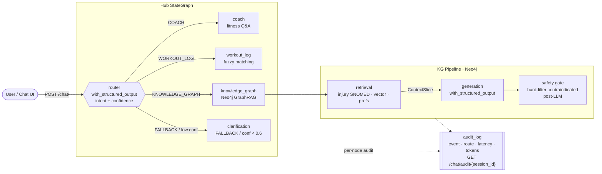
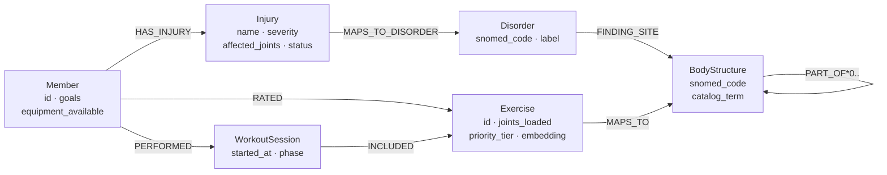
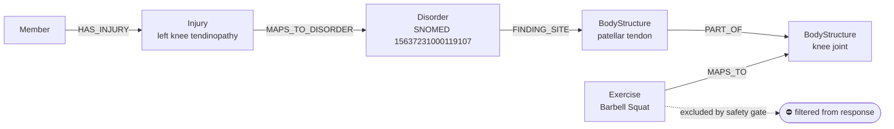
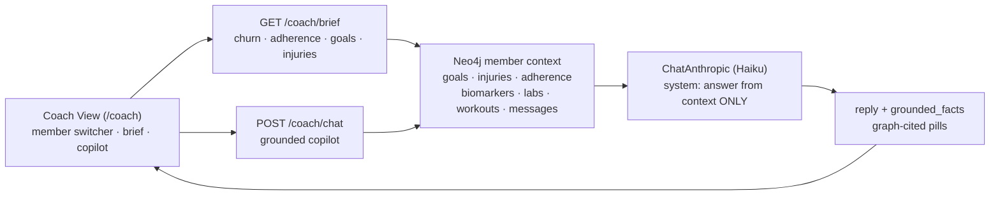

# Demo Run Book — Workout Wiz

**Audience**: Recruiting engineers / AI engineering assessors  
**Duration**: 2–3 minutes  
**Last updated**: 2026-06-08

---

## Hub Architecture



---

## Knowledge Graph Schema

Node types and relationships in the Neo4j coaching graph. The SNOMED-grounded nodes (`Disorder`, `BodyStructure`) are frozen at build time from `backend/data/snomed_subset.json`.



---

## SNOMED Safety Traversal

The contraindication filter follows this path deterministically through graph structure — no string comparison, no prompt instruction. A post-LLM `safety_gate_node` hard-filters any exercise whose ID appears at the end of this traversal.



---

## Coach Copilot Pipeline

A second, **coach-facing** surface at `/coach` (separate from the member hub). It assembles the full member context from Neo4j and answers the human coach's questions grounded in that context only — every answer carries graph-cited `grounded_facts` pills. Endpoints: `/coach/members`, `/coach/brief`, `/coach/chat`.



---

## Setup (pre-demo, do not narrate)

- [ ] Valid `ANTHROPIC_API_KEY` in root `.env`
- [ ] `make dev` — frontend :5173, backend :8000, postgres :5433
- [ ] Neo4j running if demonstrating KG path: `docker compose up -d neo4j`
- [ ] Browser open at `http://localhost:5173`, chat page visible (log in first)
- [ ] Coach Copilot needs Neo4j seeded with member context (Jordan Rivera demo member)
- [ ] Terminal ready for `curl` audit command

**Fallback**: If stack is down, use Swagger at `http://localhost:8000/docs`

---

## Script

### Hook *(~15 s)*

> "Most fitness apps make you pick a mode before you type. Workout Wiz skips that entirely — you send one natural-language message and a language model decides what kind of request it is using structured output, not a regex."

---

### Step 1 — COACH route *(~25 s)*

**Prompt**: `How many rest days should I take per week for hypertrophy?`

**Action**: Type the prompt in the chat UI and submit.

> "Routed to COACH, confidence 0.97. The coaching sub-graph generates a grounded answer — it can only reference exercises in the 50-exercise dataset. Notice the RouteBadge in the UI: green for COACH."

**Expected result**: A substantive coaching answer; RouteBadge shows `COACH · 0.97`

---

### Step 2 — WORKOUT_LOG *(~25 s)*

**Prompt**: `I just did 3 sets of 10 bench press at 135 lbs and a 20-minute run.`

**Action**: Type and submit.

> "Routed to WORKOUT_LOG. The logger fuzzy-matches 'bench press' to the dataset entry, extracts sets, reps, and weight, and returns a structured JSON log. If match confidence is low it reports it explicitly rather than silently accepting the wrong exercise."

**Expected result**: Structured JSON log with resolved exercise ID, sets, reps, weight

---

### Step 3 — KNOWLEDGE_GRAPH workout generation + injury safety *(~40 s)*

**Prompt**: `I have a bad knee and a bad shoulder. Build me a workout that avoids aggravating either injury.`

**Action**: Type and submit.

> "Routed to KNOWLEDGE_GRAPH, confidence 0.99 — every 'build me a workout' request lands here, and the router picks it over COACH on injury context alone. The retrieval sub-graph traverses Neo4j: member profile (including available equipment), then injury nodes via SNOMED CT codes through MAPS_TO_DISORDER → FINDING_SITE → PART_OF edges. That produces a hard exclusion list of exercise IDs — 21 exercises in this run. The generation graph assembles a warmup/main/cooldown plan, then a safety gate node hard-filters the LLM output against that exclusion list after generation. The filter is code, not a prompt. Each recommended exercise carries a SNOMED-grounded provenance trace you can read: disorder code, finding site, graph path."

**Expected result**: Warmup/main/cooldown plan avoiding knee and shoulder loading; provenance objects on each recommendation; N exercises excluded stated in response

---

### Step 4 — FALLBACK *(~15 s)*

**Prompt**: `What's the best recipe for banana bread?`

**Action**: Type and submit.

> "FALLBACK, confidence 0.99. Out-of-scope, no crash, polite deflection."

**Expected result**: RouteBadge shows `FALLBACK · 0.99`; message says system handles fitness only

---

### Step 5 — Coach Copilot (coach-facing) *(~35 s)*

**Action**: Navigate to `/coach`. Pick a member in the switcher, then click the **"How's adherence trending?"** quick-prompt.

> "Now switch personas. This is the coach-facing copilot — a separate surface from the member chat. The morning brief is built live from Neo4j: churn risk, adherence trend, goals, injuries, message pattern. When I ask about adherence, the copilot answers using *only* this member's graph context — the system prompt forbids inventing data. See the grounded-facts pills under the reply: each one is a fact pulled straight from the graph, so the coach can trust it and repeat it to the member."

**Expected result**: Brief dashboard (churn risk badge, adherence bars, goals, injuries); chat reply citing the member's actual adherence numbers; `grounded_facts` pills rendered beneath the reply

---

### Step 6 — Audit trail *(~20 s)*

**Action**: Run in terminal:
```bash
curl http://localhost:8000/chat/audit/<SESSION_ID> | python3 -m json.tool
```

> "Every message in this session is in the audit log — event name, model, route, confidence, latency in milliseconds, token counts. This is the data you'd ship to Prometheus or Datadog to monitor routing accuracy and detect drift."

**Expected result**: JSON array with one entry per agent node per message; latency_ms and tokens_in/out populated

---

### Wrap *(~15 s)*

> "One conversational interface, four routing paths — each a separate LangGraph sub-graph. LLM structured output does the routing. The injury safety gate is code, not a prompt. A second coach-facing copilot answers grounded only in the member's graph. Full audit trail per session. The README covers production scaling, failure modes, and evaluation strategy."

---

## Timing Guide

| Section | Target |
|---------|--------|
| Hook | 15 s |
| Step 1 — COACH | 25 s |
| Step 2 — WORKOUT_LOG | 25 s |
| Step 3 — KNOWLEDGE_GRAPH | 40 s |
| Step 4 — FALLBACK | 15 s |
| Step 5 — Coach Copilot | 35 s |
| Step 6 — Audit | 20 s |
| Wrap | 15 s |
| **Total** | **~2 min 50 s** |

---

## Contingency Notes

- **If LLM is slow**: Use fallback prompts below; the demo transcript in the README shows expected output verbatim
- **If Neo4j is down**: Skip Step 3; substitute "KNOWLEDGE_GRAPH is also implemented — the README shows a live trace with 21 exercises excluded via SNOMED traversal"
- **If asked about the 66% scenario-suite pass rate**: Honest answer — those test cases require the full Neo4j stack or exercise the LLM-dependent no-results recovery path; they are documented known gaps, not regressions
- **If asked about Assessment 2**: GraphRAG pipeline (retrieval sub-graph, vector similarity, SNOMED traversal, safety gate, preference feedback) is implemented; richer member-context ingestion (biomarkers, HRV) is the main gap

---

## Fallback Prompts

| Route | Backup prompt |
|-------|---------------|
| COACH | "How many sets per muscle group for hypertrophy?" |
| WORKOUT_LOG | "I just did 3 sets of 10 squat at 225 lbs." |
| KNOWLEDGE_GRAPH | "Give me a 45-minute full-body strength workout with dumbbells." |
| KNOWLEDGE_GRAPH (injury) | "Build a lower body session that avoids knee stress." |
| FALLBACK | "What's the capital of France?" |

---

## Key URLs

| Resource | URL |
|----------|-----|
| Chat UI (member hub) | http://localhost:5173/chat |
| Coach Copilot | http://localhost:5173/coach |
| Backend Swagger | http://localhost:8000/docs |
| Health check | http://localhost:8000/healthz |
| Audit log | http://localhost:8000/chat/audit/{session_id} |
| KG recommend | POST http://localhost:8000/kg/recommend |
| KG explain | POST http://localhost:8000/kg/explain |
| Coach brief / chat | GET /coach/brief · POST /coach/chat |

---

## Requirements Coverage

| # | Requirement | Source | Status |
|---|-------------|--------|--------|
| REQ-01 | Hub routes via `with_structured_output`, not regex | PRD-001 AC-1.1 | **Covered** — `RouteDecision` structured output |
| REQ-02 | COACH intent → coaching sub-agent, grounded answer | PRD-001 US-1 | **Covered** — Step 1 |
| REQ-03 | Workout generation produces warmup/main/cooldown plan | PRD-001 AC-2.2 | **Covered** — KNOWLEDGE_GRAPH generation path (Step 3) |
| REQ-04 | All exercises traceable to exercises.json | PRD-001 AC-2.3 | **Covered** — generation chooses from `safe_exercises` only; safety gate validates IDs |
| REQ-05 | Equipment/time constraints reflected in plan | PRD-001 AC-2.4 | **Covered** — KG retrieval scopes candidates to `Member.equipment_available` (Step 3) |
| REQ-06 | WORKOUT_LOG → structured JSON with fuzzy-matched ID | PRD-001 AC-3.2–3.3 | **Covered** — Step 2 |
| REQ-07 | Low-confidence inputs → clarification, not misroute | PRD-001 AC-4.1 | **Covered** — clarification node at confidence < 0.6 |
| REQ-08 | Edge cases → user-facing message, no crash | PRD-001 AC-4.2 | **Covered** — Step 4 FALLBACK + global handler |
| REQ-09 | README production evaluation section | PRD-001 AC-4.3 | **Covered** — README "Production Evaluation" |
| REQ-10 | Injury contraindication hard-filter (not prompt) | PRD-002 AC-1.2 | **Covered** — Step 3 safety gate |
| REQ-11 | Graph-traceable explainability per recommendation | PRD-002 AC-2.1 | **Covered** — SNOMED provenance objects |
| REQ-12 | Preference feedback writeback | PRD-002 US-4 | **Covered** — FeedbackForm → POST /kg/feedback |
| REQ-13 | Coach-facing copilot surfaces member context (injuries, adherence, goals) grounded in the graph | PRD-002 US-3 | **Covered** — Step 5 `/coach` brief + grounded chat |
| REQ-14 | Copilot distinguishes graph-grounded facts from inferred context | PRD-002 US-3 AC-3 | **Covered** — `grounded_facts` pills + "answer from context ONLY" system prompt |

**Gaps**: None against PRD-001 or PRD-002 core acceptance criteria.

**Undocumented features** (implemented but without a PRD requirement):
- AgentTrace UI component — per-step tool call breakdown in the chat UI
- RouteBadge — colour-coded route + confidence badge on each chat bubble
- EnjoymentScale / FeedbackForm — 1–5 star rating written back to Neo4j
- PhaseTable — warmup/main/cooldown structured table rendered in chat
- `/kg/audit/{member_id}` — KG-layer audit log separate from hub audit
- Eval suite (golden 11/11, scenarios 27/41, replays 5/5) with `make eval-stats` trend tracking
