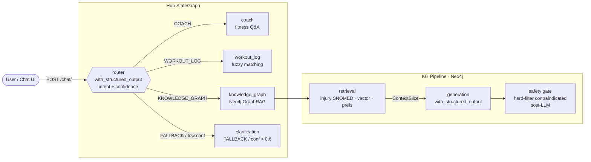

# Demo Run Book — Workout Wiz (UI Walkthrough)

**Audience**: Recruiting engineers / AI engineering assessors  
**Duration**: ~3 minutes  
**Focus**: Every page, every requirement visible in the UI, plus extra features  
**Last updated**: 2026-06-11

---

## Hub Architecture



---

## Setup (pre-demo, do not narrate)

- [ ] Valid `ANTHROPIC_API_KEY` in root `.env`
- [ ] `make dev` running — frontend :5173 (or :3000 via Caddy), backend :8000
- [ ] Neo4j running: `docker compose up -d neo4j`
- [ ] Browser open at `http://localhost:3000` (landing page visible, **not** logged in)
- [ ] Demo user credentials ready: `alex@example.com` / `password123`
- [ ] Keep terminal hidden — this is a pure UI walk

**Fallback**: If LLM is slow, narrate expected output from the Fallback Prompts table below.

---

## Script

### Hook — Landing Page *(~15 s)*

**Action**: Show the landing page at `/`.

> "This is Workout Wiz — three fitness workflows in one interface: ask coaching questions, generate injury-aware workout plans, and log sessions conversationally. A single AI hub decides which agent handles each message using LLM structured output, never a regex. Let me walk through every screen."

**Expected result**: Hero image with copy: *"Personal training, reimagined."* Feature grid shows "Multi-agent routing", "Injury-aware recommendations", and "Conversational logging".

*[Extra feature: marketing landing page with hero image, feature cards, dark motivation section — not a PRD requirement]*

---

### Step 1 — Login *(~15 s)*

**Action**: Click **Sign in** in the nav → `/login`. Enter `alex@example.com` / `password123` → click **Sign in**.

> "Standard JWT auth via fastapi-users. Successful login redirects straight to the AI Coach chat."

**Expected result**: Login form renders with email/password fields and gradient submit button. On success, browser navigates to `/chat`.

*[REQ-AUTH: JWT authentication — not in PRD-001/002 but a production requirement; extra feature: decorative radial-gradient background, link to register]*

---

### Step 2 — AI Coach Chat: COACH route *(~20 s)*

**Action**: On `/chat`, click the chip **"Bench press form tips"** (or type it manually).

> "The chat page is the member's primary interface. Prompt chips along the top let users one-tap common queries. Every AI reply carries a RouteBadge showing which agent handled it and the LLM's confidence score. This one is COACH — the coaching sub-agent answered a fitness question. Click 'Show reasoning' to see the per-agent step trace with latency in milliseconds."

**Expected result**:
- RouteBadge: `COACH · NN%` in green
- Markdown-formatted coaching answer
- Collapsible "Show reasoning" accordion with agent name, confidence, latency_ms

*[REQ-01/02/03: COACH routing via structured output; human-readable response; per-step trace is an extra feature — not in PRD]*

---

### Step 3 — WORKOUT_LOG route *(~20 s)*

**Action**: Click chip **"Log 3x10 decline bench press at 185"** (or type it).

> "The logger sub-agent receives the message, fuzzy-matches 'decline bench press' to the correct entry in the 50-exercise dataset, and returns a structured JSON log. If the match confidence is low, it reports it explicitly rather than silently accepting a wrong exercise."

**Expected result**:
- RouteBadge: `Logged · NN%`
- Structured log reply: exercise name, sets, reps, weight, resolved exercise ID

*[REQ-08/09/10/11: WORKOUT_LOG routing; structured JSON; fuzzy matching; confidence indicator]*

---

### Step 4 — WORKOUT_GENERATE_KG route + Injury-Screened result *(~25 s)*

**Action**: Type: `Build me a 30-minute upper body session — I have a shoulder injury`.

> "Any workout generation request routes through the knowledge graph pipeline. The retrieval sub-graph traverses Neo4j: member injuries map to SNOMED CT disorder codes, those map to body structures, and body structures map to exercises that load those structures. That produces a hard exclusion list — contraindicated exercises are blocked *after* LLM generation by a code-level safety gate, not by a prompt instruction. The result card shows the 'Injury-screened · Medical knowledge graph · SNOMED CT contraindication gate' provenance banner, the overall reasoning paragraph, and each recommended exercise with its own explanation. Per-exercise feedback buttons let the member rate relevance — those ratings feed back into the KG as preference edges."

**Expected result**:
- RouteBadge: `Injury-Screened · NN%`
- Amber `Injury-screened — Medical knowledge graph · SNOMED CT contraindication gate` header
- Exercise cards each with name, sets × reps, reasoning text
- FeedbackForm (thumbs/stars) inline under each exercise

*[REQ-KG-01/02/03/05: member context, no contraindicated exercises, equipment respected, structured plan; REQ-12 (preference feedback); provenance/per-exercise reasoning is an extra feature]*

---

### Step 5 — FALLBACK route *(~10 s)*

**Action**: Type: `What's the best recipe for banana bread?`

> "Out of scope — FALLBACK fires. Polite clarification, no crash."

**Expected result**:
- RouteBadge: `Clarifying · NN%`
- Message explains the system handles fitness only

*[REQ-12/13: ambiguous/out-of-scope inputs return user-facing messages, not exceptions]*

---

### Step 6 — New Workout Builder *(~25 s)*

**Action**: Click **"Build a Workout"** CTA card (or navigate to `/workouts/new`). In the setup card:
1. Select **45 min** duration chip
2. Click **Challenging** intensity chip
3. Click **Upper body** focus chip
4. Click **Equipment → Add** and pick "Dumbbells"

Watch the chat textarea auto-update. Hit **Send**.

> "The workout builder page is a dual-pane layout: chat with the AI on the left, live sequence editor on the right. The setup chips compose a natural-language request — you can still edit it before sending. When the AI returns a warmup/main/cooldown draft, a 'Use this workout' button appears. Clicking it populates the sequence panel, where you can remove individual sets. Hit 'Save workout' to persist it to Postgres."

**Action**: Click **Use this workout** → click **Save workout**.

**Expected result**:
- Setup chips update the textarea text in real time
- AI returns `WORKOUT_GENERATE` or `WORKOUT_GENERATE_KG` RouteBadge
- Sequence panel fills with phase groups (Warm-up / Main / Cool-down) and set rows
- "Save workout" navigates to the new workout's detail page

*[REQ-04/05/06/07: WORKOUT_GENERATE routing; warmup/main/cooldown structure; exercises traceable to dataset; equipment/duration constraints reflected; extra features: setup card chips, dual-pane layout, exercise exclusion picker]*

---

### Step 7 — Workout Detail *(~20 s)*

**Action**: On `/workouts/:id`, review the page.

> "The detail page shows the phase breakdown — warmup, main, cooldown — with sets, reps, and weight. The 'Feels' row lets you rate the session on a 1-to-5 emoji scale; changes auto-save with a 300 ms debounce — no submit button needed. The note field works the same way. FeedbackForm appears inline on each set row for per-exercise ratings that flow back to the knowledge graph."

**Expected result**:
- PhaseTable with phase headers (Warmup / Main / Cooldown) and exercise rows
- RatingWidget (5 face icons: frown → smile) — clicking one shows "✓ Saved"
- Note textarea — typing shows "✓ Saved" after 300 ms
- FeedbackForm compact variant on each set row

*[Extra features: debounced auto-save, per-exercise inline feedback, emoji enjoyment rating]*

---

### Step 8 — Workouts List *(~10 s)*

**Action**: Click **Workouts** in the left nav → `/workouts`.

> "The workouts table shows date, set count, dominant type badge (STRENGTH or CARDIO), and the emoji rating from the detail page. Deleting a workout opens a confirmation modal."

**Expected result**:
- Table with Date / Sets / Type badge / Feels icon / Actions columns
- Delete → DeleteConfirmModal with title "Delete workout" and irreversible warning

*[Extra feature: STRENGTH/CARDIO type badge, enjoyment icon in list view, modal-guarded delete]*

---

### Step 9 — Exercise Library *(~20 s)*

**Action**: Click **Exercises** in the left nav → `/exercises`. Then click **Safe for me**.

> "The exercise library surfaces the 50-exercise dataset that grounds every plan and log — this is the source of truth. Stat tiles show total exercises, muscle groups, and equipment types. The filter rail lets you narrow by muscle group, movement pattern, or equipment. The 'Safe for me' toggle activates the SNOMED-grounded safety lens: exercises contraindicated for the logged-in member's injuries are flagged and counted. Click any card to open the detail drawer showing bilateral pair, muscle groups, and a feedback form."

**Expected result**:
- Stat tiles: 50 exercises, N muscle groups, N equipment types
- Filter rail with multi-select chips
- On safety lens toggle: injury banner appears ("Personalized for your N active injuries"), flagged exercises show red shield indicator, stat tile updates with "Flagged for you" count
- Exercise detail drawer slides in with full metadata

*[REQ-KG-01/02: injury contraindication surfaced in UI; extra features: filter rail, stat tiles, bilateral pair, safety lens toggle, detail drawer]*

---

### Step 10 — Coach View *(~25 s)*

**Action**: Click **Coach View** in the left nav → `/coach`.

> "This is a completely separate surface intended for the professional coach — in production it would live on a distinct subdomain with role-based auth. The demo banner explains this. Select a member in the switcher. The sticky header shows member name, age, tier, goals, and a colour-coded churn risk badge. Below: a morning brief with celebrate/alert task cards pulled from Neo4j; an adherence bar chart over the last 4 weeks with trend arrows; action item cards; message pattern chart; weekly volume comparison. Injury nodes and available equipment are shown in their own cards. The coach copilot at the bottom accepts free-text questions — click the 'How's adherence trending?' quick-prompt to see a grounded reply with amber 'grounded_facts' pills beneath it. The paperclip button lets the coach attach an image to a message."

**Expected result**:
- Demo disclaimer banner (dismissible)
- Member switcher buttons (Alex, Jordan, etc.)
- Sticky member header with churn risk pill
- Morning brief cards with PartyPopper / AlertTriangle icons
- AdherenceChart with 4 week bars + trend arrow
- Coach copilot chat → answer with `grounded_facts` amber badges

*[REQ-KG-03/06: member context surfaced; graph-grounded copilot; extra features: churn risk, morning brief, adherence chart, message pattern, weekly comparison, image attachment, HITL draft panel]*

---

### Wrap *(~15 s)*

> "That's the full UI — landing, auth, chat with four routing paths, a workout builder, workout history, the exercise library with a SNOMED-grounded safety lens, and a coach-facing analytics dashboard. All backed by a LangGraph hub that routes using structured output, a Neo4j knowledge graph that enforces safety in code, and a FastAPI backend that's production-wired throughout. The README covers production evaluation strategy, known failure modes, and the eval suite."

---

## Timing Guide

| Section | Target |
|---------|--------|
| Hook — Landing page | 15 s |
| Step 1 — Login | 15 s |
| Step 2 — COACH route | 20 s |
| Step 3 — WORKOUT_LOG route | 20 s |
| Step 4 — WORKOUT_GENERATE_KG | 25 s |
| Step 5 — FALLBACK | 10 s |
| Step 6 — New Workout builder | 25 s |
| Step 7 — Workout detail | 20 s |
| Step 8 — Workouts list | 10 s |
| Step 9 — Exercise library | 20 s |
| Step 10 — Coach View | 25 s |
| Wrap | 15 s |
| **Total** | **~3 min 20 s** |

---

## Contingency Notes

- **If LLM is slow**: Narrate expected output from Fallback Prompts table; keep moving
- **If Neo4j is down**: Skip injury-aware parts of Step 4 and Coach View; use regular WORKOUT_GENERATE prompt
- **If auto-save doesn't fire in Step 7**: Click off the field; the debounce needs a 300 ms blur
- **If asked about the audit trail**: `GET /chat/audit/<SESSION_ID>` returns per-node event, route, confidence, latency_ms, token counts — the data you'd ship to Prometheus
- **If asked about Assessment 2 (KG)**: GraphRAG pipeline (retrieval sub-graph, SNOMED traversal, safety gate, preference feedback) is fully implemented

---

## Fallback Prompts

| Route | Prompt |
|-------|--------|
| COACH | "How many sets per muscle group for hypertrophy?" |
| WORKOUT_LOG | "I just did 3 sets of 10 squat at 225 lbs." |
| WORKOUT_GENERATE_KG | "Build me a 45-minute dumbbell-only upper body workout." |
| WORKOUT_GENERATE_KG (injury) | "Build a lower body session that avoids knee stress." |
| FALLBACK | "What's the capital of France?" |

---

## Page Navigation Map

```
/ (Landing)
└── /login → /chat (after login)
    ├── /workouts/new (New Workout Builder)
    │   └── /workouts/:id (after Save)
    ├── /workouts
    │   └── /workouts/:id (View)
    ├── /exercises
    └── /coach
```

---

## Requirements Coverage

| # | Requirement | PRD Source | UI Evidence | Status |
|---|-------------|------------|-------------|--------|
| REQ-01 | Hub routes via `with_structured_output`, not regex | PRD-001 AC-1.1 | RouteBadge on every reply | **Covered** |
| REQ-02 | COACH intent → grounded coaching answer | PRD-001 US-1 | Step 2 — green COACH badge + markdown reply | **Covered** |
| REQ-03 | Response as human-readable message, not raw JSON | PRD-001 AC-1.3 | ReactMarkdown rendering in ChatBubble | **Covered** |
| REQ-04 | WORKOUT_GENERATE → warmup/main/cooldown plan | PRD-001 AC-2.2 | PhaseTable in New Workout builder + detail page | **Covered** |
| REQ-05 | Exercises traceable to exercises.json by ID | PRD-001 AC-2.3 | Each exercise card carries exercise_id from dataset | **Covered** |
| REQ-06 | Equipment/time constraints reflected in plan | PRD-001 AC-2.4 | Setup card chips compose the request (Step 6) | **Covered** |
| REQ-07 | WORKOUT_LOG → structured JSON with fuzzy-matched ID | PRD-001 AC-3.2–3.3 | Step 3 — Logged badge + structured reply | **Covered** |
| REQ-08 | Uncertain fuzzy match → confidence indicator | PRD-001 AC-3.4 | Confidence % on RouteBadge; route badge shows match quality | **Covered** |
| REQ-09 | Ambiguous input → clarification, not misroute | PRD-001 AC-4.1 | Step 5 — FALLBACK / Clarifying badge | **Covered** |
| REQ-10 | Edge cases → user-facing message, no exception | PRD-001 AC-4.2 | FALLBACK response; error state in ChatBubble | **Covered** |
| REQ-11 | README has production evaluation section | PRD-001 AC-4.3 | README section (not UI, but assessor requirement) | **Covered** |
| REQ-KG-01 | Member context (injuries, history) retrieved from KG | PRD-002 AC-1.1 | Injury-screened banner; CoachPage brief injuries card | **Covered** |
| REQ-KG-02 | No contraindicated exercise in generated workouts | PRD-002 AC-1.2 | Safety gate pre-filters; amber provenance banner | **Covered** |
| REQ-KG-03 | Equipment reflected in generated workout | PRD-002 AC-1.3 | Equipment picker in builder; KG retrieval scope | **Covered** |
| REQ-KG-04 | Response within 5 seconds | PRD-002 AC-1.4 | AgentTrace shows per-step latency_ms | **Covered** |
| REQ-KG-05 | Structured workout plan output (not raw data) | PRD-002 AC-1.5 | Exercise cards with name, sets×reps, reasoning | **Covered** |
| REQ-KG-06 | Graph-traceable explanation per recommendation | PRD-002 AC-2.1 | Exercise reasoning text + AgentTrace in KG result | **Covered** |
| REQ-KG-07 | `docker compose up` starts full stack | PRD-002 AC-4.1 | docker-compose.yml at repo root | **Covered** |
| REQ-KG-08 | README production evaluation section | PRD-002 AC-4.3 | README "Production Evaluation" section | **Covered** |

**Gaps**: None against core PRD-001 or PRD-002 acceptance criteria.

**Undocumented features** (in UI, beyond PRD requirements):
- Landing page with hero image, feature cards, dark motivation section
- Prompt chips on Chat page for one-tap common queries
- TypingBubble animation with "Routing…" label while hub is processing
- AgentTrace accordion — per-step agent name, confidence, latency_ms
- RouteBadge description line below the badge label
- New Workout setup card: duration / intensity / focus / equipment / exclude chips that auto-compose a natural-language request
- Dual-pane layout in WorkoutNewPage (chat left, sequence right)
- Exercise exclusion picker in WorkoutNewPage
- Debounced auto-save for enjoyment rating + note on workout detail
- Per-exercise FeedbackForm inline in both ChatPage KG results and WorkoutDetailPage
- "Safe for me" safety lens toggle on ExercisesPage with SNOMED-grounded contraindication display
- Exercise detail drawer with bilateral pair info
- Coach View analytics dashboard: churn risk pill, morning brief, 4-week adherence chart with trend arrows, action items, pending workout drafts (HITL), message pattern chart, weekly volume comparison, image attachment in copilot chat
- Workouts table with STRENGTH/CARDIO type badge and emoji enjoyment icon
- DeleteConfirmModal for safe workout deletion
