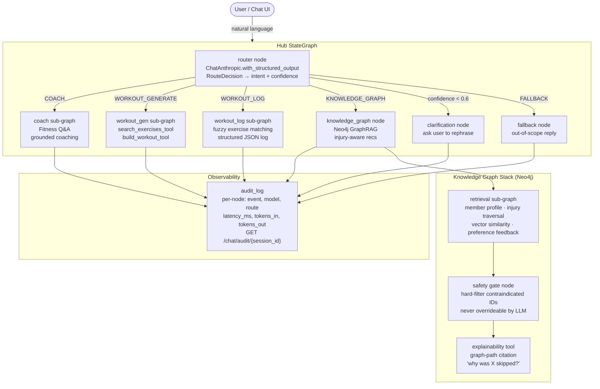

# Workout Wiz — Demo Run Book

**Audience**: Recruiting engineers / AI engineering assessors  
**Duration**: 2–3 minutes  
**Format**: Narrated walkthrough of a running local stack  
**Stack**: FastAPI + LangGraph + Neo4j + Vite/React  

> **Scope note**: This project covers both assessments. Assessment 1 (multi-agent hub) is fully implemented — typed `StateGraph`, separate sub-graphs, structured-output routing, clarification node, fuzzy logger. Assessment 2 (knowledge graph) is partially implemented — the Neo4j GraphRAG pipeline, injury safety gate, vector similarity search, and preference feedback loop are all wired and running; the richer member-context ingestion (biomarkers, HRV, adherence signals) is the main gap. The demo covers both layers.

---

## Hub Architecture



---

## Pre-Flight Checklist

Before starting the demo, verify the following:

- [ ] `.env` at repo root contains a valid `ANTHROPIC_API_KEY`
- [ ] Docker is running
- [ ] `make dev` has been run; all three services are up (frontend :5173, backend :8000, postgres :5433)
- [ ] Neo4j is running (if demonstrating the KG path): `docker compose up -d neo4j`
- [ ] Browser is open at `http://localhost:5173`
- [ ] The chat page is visible (log in first if needed — any email/password)
- [ ] Terminal window showing backend logs is ready for showing audit output

**Fallback**: If the full stack is unavailable, the multi-agent demo can be run against the backend alone at `http://localhost:8000` (interactive Swagger UI at `/docs`).

---

## Demo Script

### Hook

> "Most fitness apps force you to pick a mode before you type. Workout Wiz removes that entirely — you send one natural-language message and the system decides what kind of request it is. The routing decision is made by a language model using structured output, not a regex or keyword list."

---

### COACH

> "The hub routed this to the COACH sub-agent — COACH, confidence 0.97. The coach graph generates a substantive answer grounded entirely in the exercise dataset. No hallucinated exercises."

---

### WORKOUT_GENERATE

> "Routed to WORKOUT_GENERATE, confidence 0.95. The generator sub-agent calls two tools: search_exercises_tool queries the 50-exercise Postgres dataset by muscle group and equipment, then build_workout_tool assembles the plan into warmup, main, and cooldown phases. Every exercise ID in the plan is validated against the dataset — hallucinated UUIDs land in invalid_ids_skipped in the audit log."

---

### WORKOUT_GENERATE — equipment constraint

> "Same generator sub-graph, equipment constraint passed in plain English. search_exercises_tool filtered the dataset down to bands and bodyweight movements only. invalid_ids_skipped is empty — zero hallucinated UUIDs. The constraint was enforced through dataset filtering, not prompt instruction."

---

### WORKOUT_LOG

> "Routed to WORKOUT_LOG. The logger sub-agent fuzzy-matches the exercise name to the dataset, extracts sets, reps, and weight, and returns a structured JSON log entry with the resolved exercise ID. If match confidence is low, the system reports it rather than silently accepting the wrong exercise."

---

### KNOWLEDGE_GRAPH

> "Routed to KNOWLEDGE_GRAPH. The retrieval sub-graph queries Neo4j — member profile, injury nodes, joint and muscle contraindications, workout history, and preference feedback from past sessions. A safety gate node then hard-filters any exercise whose ID appears in contraindicated_ids. This filter runs after the LLM generation step, so even if the model ignores the instruction, no contraindicated exercise can reach the response. Each recommended exercise shows the reasoning — a sentence that traces back to the graph path, not a generic LLM rationale."

---

### KNOWLEDGE_GRAPH — injury trace

> "Two injuries, one message. Route is KNOWLEDGE_GRAPH, confidence 0.99 — the router correctly distinguished this from a workout generation request based on the injury context alone. The retrieval sub-graph ran the injury traversal node. The safety gate ran after the LLM — hard code, not a prompt. The response explicitly states how many exercises were excluded: five."

---

### FALLBACK

> "FALLBACK, confidence 0.99. The hub recognises this is out of scope and returns a polite deflection — no crash, no silent misroute."

---

### Audit trail

```bash
curl http://localhost:8000/chat/audit/<SESSION_ID> | python3 -m json.tool
```

> "Every message in this session is in the audit log. Each entry records the event name, model, route, confidence, latency in milliseconds, and token counts. This is the data you'd ship to a metrics store — Prometheus, Datadog, whatever — to monitor routing accuracy and flag when something drifts."

---

### Eval suite

```bash
make eval-stats
```

> "Three suites. Golden is the hard gate — 11 cases covering every routing path and edge case, 100% across nine recorded runs, trend from 91% up to 100% as the system was tuned. The scenario suite has 41 cases and sits at 66% — that's an honest number, it's testing known gaps in the knowledge graph layer. The replay suite is five frozen fixtures that run without an API key — those are what run in CI."

---

### Close

> "One conversational interface, five routing paths — COACH, WORKOUT_GENERATE, WORKOUT_LOG, KNOWLEDGE_GRAPH, and FALLBACK — each a separate LangGraph sub-agent. LLM structured output does the routing, not regex. The injury safety gate is a hard code filter, not a prompt instruction. Full audit trail available per session. The README covers production scaling, failure modes, and evaluation strategy."

---

## Timing Summary

| Step | Action | Target time |
|------|--------|-------------|
| Hook | Intro sentence | 15 s |
| 1 | COACH route | 30 s |
| 2 | WORKOUT_GENERATE route | 45 s |
| 2b | Equipment constraint example | 30 s |
| 3 | WORKOUT_LOG route | 30 s |
| 4 | KNOWLEDGE_GRAPH route | 45 s |
| 4b | Injury trace (knee + shoulder) | 45 s |
| 5 | FALLBACK route | 15 s |
| 6 | Audit trail | 20 s |
| 6b | Eval stats (`make eval-stats`) | 20 s |
| Close | Summary | 15 s |
| **Full run** | | **~5 min 10 s** |
| **Trim (drop 2b, 4b, 6b)** | | **~3 min 35 s** |

Steps 2b, 4b, and 6b are the new additions; drop them to hit the original 3-minute mark.

---

## Fallback Prompts (if LLM response is slow or off)

| Intent | Backup prompt |
|--------|---------------|
| COACH | "How many sets per muscle group for hypertrophy?" |
| WORKOUT_GENERATE | "Give me a 45-minute full-body strength workout with dumbbells." |
| WORKOUT_LOG | "I just did 3 sets of 10 squat at 225 lbs." |
| KNOWLEDGE_GRAPH | "Build a lower body session that avoids knee stress." |
| FALLBACK | "What's the capital of France?" |

---

## Key URLs

| Resource | URL |
|----------|-----|
| Chat UI | http://localhost:5173 |
| Backend Swagger | http://localhost:8000/docs |
| Health check | http://localhost:8000/healthz |
| Audit log | http://localhost:8000/chat/audit/{session_id} |
| KG recommend | POST http://localhost:8000/kg/recommend |
| KG explain | POST http://localhost:8000/kg/explain |
| KG audit | GET http://localhost:8000/kg/audit/{member_id} |

---

## Requirements Coverage

| Requirement | Source | Status |
|-------------|--------|--------|
| Hub routes via LLM structured output (not regex) | PRD-001 AC-1.1, CLAUDE.md | Covered — `with_structured_output(RouteDecision)` |
| COACH, WORKOUT_GENERATE, WORKOUT_LOG, FALLBACK intents | PRD-001 US-1–4 | Covered |
| KNOWLEDGE_GRAPH intent | PRD-002 US-1 | Covered |
| Workout grounded in exercises.json only | PRD-001 AC-2.3 | Covered — `search_exercises_tool` + `build_workout_tool` |
| Fuzzy exercise matching in logger | PRD-001 AC-3.3 | Covered — logger sub-agent |
| Injury contraindication filtering (hard gate) | PRD-002 AC-1.2 | Covered — `_safety_gate_node` post-LLM filter |
| Graph-traceable explainability | PRD-002 AC-2.1 | Covered — `explain_skipped_exercise` + `/kg/explain` endpoint |
| Edge case resilience (no crash on bad input) | PRD-001 AC-4.2 | Covered — clarification node + global exception handler |
| Per-session audit log with latency + tokens | README production eval | Covered — `audit_log` in hub state, `/chat/audit/{session_id}` |
| Production evaluation README section | PRD-001 AC-4.3 | Covered — README.md "How I Would Productionize This" |
| Preference feedback writeback | PRD-002 US-4 | Covered — FeedbackForm → POST /kg/feedback → Neo4j |
| Single-command stack start | PRD-002 SM-5 | Covered — `make dev` |

**Gaps**: None against PRD-001 or PRD-002 core acceptance criteria.

**Undocumented features** (implemented but not in a PRD):
- AgentTrace component (frontend) — shows per-step tool call breakdown
- RouteBadge component — colour-coded route badge on each chat bubble
- EnjoymentScale + FeedbackForm — 1–5 rating written back to Neo4j
- PhaseTable — warmup/main/cooldown structured table in chat
- `/kg/audit/{member_id}` endpoint — KG-layer audit log separate from hub audit
