<!-- _class: lead -->

# Workout Wiz

### One chat interface. Five intelligent routes.

**LangGraph · FastAPI · Neo4j · React**

<!--
Speaker note: "Most fitness apps force you to pick a mode before you type. Workout Wiz removes that entirely — you send one natural-language message and the system decides what kind of request it is. The routing decision is made by a language model using structured output, not a regex or keyword list."
-->

---

## The Problem

Users juggle **three separate workflows** that belong together:

- Ask a coaching question → open a Q&A tab
- Generate a workout → open a planner tab
- Log a session → open a tracker tab

**No single conversational interface unifies them — and no app enforces injury safety across all three.**

<!--
Speaker note: "Most fitness apps force you to pick a mode before you type. Workout Wiz removes that entirely — you send one natural-language message and the system decides what kind of request it is."
-->

---

## Architecture

<style scoped>
img[alt="Architecture"] { max-height: 600px; display: block; margin: 0 auto; }
</style>



<!--
Speaker note: "The hub is a LangGraph StateGraph with a router node that calls Claude via with_structured_output — producing a RouteDecision with an intent and a confidence score. Five sub-graphs handle the actual work. Every node appends to an audit log."
-->

---

## Routing — LLM Structured Output, Not Regex

```python
llm = ChatAnthropic(model=model_name).with_structured_output(
    RouteDecision, include_raw=True
)
```

| Input | Route | Confidence |
|-------|-------|-----------|
| "How many rest days for hypertrophy?" | COACH | 0.97 |
| "30 min dumbbell workout" | WORKOUT_GENERATE | 0.95 |
| "Log 3x10 bench at 185" | WORKOUT_LOG | 0.93 |
| "What exercises suit my injuries?" | KNOWLEDGE_GRAPH | 0.91 |
| "What's the capital of France?" | FALLBACK | 0.99 |

<!--
Speaker note: "The router node sends the user's message to Claude with a structured output schema — RouteDecision — that forces the model to return an intent enum and a confidence float. Below 0.6, the hub routes to a clarification node instead of guessing."
-->

---

## Demo: COACH Route

**User types:**
> "How many rest days should I take per week for hypertrophy?"

**Route badge:** `COACH` · Confidence: 0.97 · Latency: ~450 ms

The coaching sub-graph generates a grounded response. No hallucinated exercises. No external API calls. All knowledge comes from the 50-exercise dataset and the LLM's training.

<!--
Speaker note: "I'll start with a coaching question. The hub routed this to the COACH sub-agent. You can see the route badge above the response — COACH, confidence 0.97. Every turn appends an entry to an in-memory audit log — I'll show that at the end."
-->

---

## Demo: WORKOUT_GENERATE Route

**User types:**
> "30 min dumbbell workout"

**Route badge:** `WORKOUT_GENERATE` · Confidence: 0.95 · Latency: ~1,800 ms

Two tools run inside the sub-graph:

1. **`search_exercises_tool`** — queries Postgres for dumbbell exercises by muscle group
2. **`build_workout_tool`** — assembles warmup / main / cooldown; validates every UUID

Hallucinated IDs land in `invalid_ids_skipped` in the audit log — zero tolerance.

<!--
Speaker note: "Routed to WORKOUT_GENERATE, confidence 0.95. The generator sub-agent calls two tools: search_exercises_tool queries the 50-exercise Postgres dataset by muscle group and equipment, then build_workout_tool assembles the plan into warmup, main, and cooldown phases."
-->

---

## Equipment Constraint — Resistance Bands Only

**User types:**
> "I only have resistance bands at home — no barbells, no dumbbells. Build me a 30-minute full-body workout."

**Route badge:** `WORKOUT_GENERATE` · Confidence: 0.95 · Latency: ~1,100 ms router + ~14,800 ms generator

- `search_exercises_tool` filtered the 50-exercise dataset to **bands + bodyweight only**
- `build_workout_tool` validated all IDs — `invalid_ids_skipped: []` (zero hallucinated UUIDs)
- Equipment constraint respected through **dataset filtering**, not prompt instruction alone

<!--
Speaker note: "The constraint is passed in plain English. search_exercises_tool filters the dataset and only bands and bodyweight exercises come back. build_workout_tool assembles those into a plan and validates every UUID — invalid_ids_skipped is empty, which means no hallucinated exercise IDs snuck through."
-->

---

## Demo: WORKOUT_LOG Route

**User types:**
> "Log 3x10 bench at 185"

**Route badge:** `WORKOUT_LOG` · Confidence: 0.93 · Latency: ~2,000 ms

The logger sub-agent:
- Fuzzy-matches "bench" → `Barbell Flat Bench Press` (exercises.json ID)
- Extracts sets = 3, reps = 10, weight_kg = 83.9
- Returns structured JSON with a resolved exercise ID

If fuzzy confidence is low, the system reports it rather than silently accepting a wrong match.

<!--
Speaker note: "Routed to WORKOUT_LOG. The logger sub-agent fuzzy-matches 'bench' to 'Barbell Flat Bench Press' in the dataset, extracts sets, reps, and weight, and returns a structured JSON log entry with the resolved exercise ID."
-->

---

## Power Feature: KNOWLEDGE_GRAPH Route

**User types:**
> "What exercises suit my injuries?"

**Route badge:** `KNOWLEDGE_GRAPH` · Confidence: 0.91 · Latency: ~3,000 ms

The retrieval sub-graph queries Neo4j:

- Member profile · injury nodes · joint/muscle contraindications
- Workout history · preference feedback (1–5 ratings)
- Vector similarity across the exercise corpus

<!--
Speaker note: "This is the power feature — injury-aware, graph-traced recommendations. The retrieval sub-graph queries Neo4j — member profile, injury nodes, joint and muscle contraindications, workout history, and preference feedback from past sessions."
-->

---

## Injury Trace — Knee + Shoulder, Live Audit

**User types:**
> "I have a bad knee and a bad shoulder. Build me a workout that avoids aggravating either injury."

**Route badge:** `KNOWLEDGE_GRAPH` · Confidence: 0.99 · Total latency: 9,318 ms

| Audit event | Latency |
|---|---|
| `retrieval_injury_traversal` | 2 ms — constraint nodes queried |
| `kg_generation_llm` | 8,497 ms — 5 exercises selected |
| `kg_generation_safety_gate` | 0 ms — 0 violations filtered |

**Reply includes:** "Note: 5 exercise(s) excluded due to injury constraints."

<!--
Speaker note: "The router sends this to KNOWLEDGE_GRAPH — not WORKOUT_GENERATE — because it detects injury context. The retrieval sub-graph runs the injury traversal node, the LLM picks exercises that minimise joint stress, then the safety gate runs as a hard code filter. The reply explicitly states how many exercises were excluded."
-->

---

## The Safety Gate — Hard Code, Not a Prompt

```python
def _safety_gate_node(state: GenerationState) -> dict:
    contraindicated: set[str] = set(context["contraindicated_ids"])
    safe = [e for e in rec.exercises
            if e.exercise_id not in contraindicated]
    # Runs AFTER LLM generation — cannot be overridden by the model
```

Even if the LLM ignores the instruction, **no contraindicated exercise reaches the response.**

Each recommended exercise carries a reasoning field tracing back to the graph path — not a generic LLM rationale.

<!--
Speaker note: "A safety gate node then hard-filters any exercise whose ID appears in contraindicated_ids. This filter runs after the LLM generation step, so even if the model ignores the instruction, no contraindicated exercise can reach the response."
-->

---

## Demo: FALLBACK Route

**User types:**
> "What's the best recipe for banana bread?"

**Route badge:** `FALLBACK` · Confidence: 0.99 · Latency: ~380 ms

> "I can help with fitness coaching, workout planning, and logging workouts. I'm not able to answer general knowledge questions."

No crash. No silent misroute. Graceful deflection.

<!--
Speaker note: "And here's what happens when someone goes off-script. FALLBACK, confidence 0.99. The hub recognises this is out of scope and returns a polite deflection — no crash, no silent misroute."
-->

---

## Observability — Per-Session Audit Log

```bash
curl http://localhost:8000/chat/audit/<SESSION_ID>
```

```json
[
  { "event": "router", "route": "WORKOUT_GENERATE",
    "confidence": 0.95, "latency_ms": 412,
    "tokens_in": 184, "tokens_out": 31 },
  { "event": "workout_gen", "model": "claude-3-5-haiku-20241022",
    "latency_ms": 1843, "tokens_in": 621, "tokens_out": 312 }
]
```

| Metric | Target |
|--------|--------|
| Router latency p95 | < 800 ms |
| Sub-agent latency p95 | < 3 000 ms |
| Routing accuracy | ≥ 90 % |

<!--
Speaker note: "Every message in this session is captured in the audit log. Each entry records the event name, model, route, confidence, latency in milliseconds, and token counts. This is the data you'd ship to a metrics store — Prometheus, Datadog, whatever — to monitor routing accuracy and flag when something drifts."
-->

---

## What Was Built

| Area | Delivered |
|------|-----------|
| **Hub router** | LangGraph StateGraph · `with_structured_output` · 5 routes |
| **Sub-agents** | COACH · WORKOUT_GENERATE · WORKOUT_LOG (separate graphs) |
| **Knowledge Graph** | Neo4j · injury traversal · vector similarity · preference feedback |
| **Safety gate** | Post-LLM hard filter on `contraindicated_ids` |
| **Explainability** | Graph-path citation via `/kg/explain` endpoint |
| **Observability** | Per-node audit log · `/chat/audit/{session_id}` · KG audit trail |
| **Frontend** | Vite + React · route badges · KG exercise cards · feedback form |
| **Resilience** | Clarification node · global exception handler · fallback route |

<!--
Speaker note: "To summarise: one conversational interface, five distinct routing paths — COACH, WORKOUT_GENERATE, WORKOUT_LOG, KNOWLEDGE_GRAPH, and FALLBACK — each handled by a separate LangGraph sub-agent. LLM structured output does the routing, not regex. The injury safety gate is a hard code filter, not a prompt instruction. And the full audit trail is available per session for production observability."
-->

---

## Evaluation Results — 12 Runs Recorded

| Suite | Cases | Latest | Trend |
|-------|-------|--------|-------|
| **Golden** (live API) | 11 | **11/11 — 100%** | ▇▆█▇█████ 91%→100% |
| **Scenarios** (coverage matrix) | 41 | 27/41 — 66% | ▅ stable |
| **Replays** (frozen, no API key) | 5 | **5/5 — 100%** | ██ 100% |

- Golden = hard gate: all critical routing paths + edge cases must pass
- Scenarios 66% reflects known gaps (no Jordan Rivera context, LLM-dependent no-results recovery)
- Replays validate parsing logic in CI without an API key

```bash
make eval-stats   # print trend table
```

<!--
Speaker note: "Golden is the shipping gate — 11 cases covering every route plus edge cases like invalid exercise IDs and low-confidence inputs. The scenario suite's 66% is honest: it's testing harder coverage including Assessment 2 gaps that aren't fully implemented. Replays run in CI without an API key and have been 100% since they were added."
-->

---

## Production Thinking

The README covers:

- **Observability**: OpenTelemetry spans → Jaeger; Prometheus metrics; structured JSON logs
- **Resilience**: Circuit breaker on DB; graceful shutdown; idempotency keys
- **Security**: Short-lived JWT + refresh tokens; Redis blocklist; rate limiting on auth
- **Scale**: Stateless API (horizontal scale); Redis exercise cache; PgBouncer; async task queue for LLM ops
- **Evaluation**: Recall@K / Precision@K for GraphRAG; adversarial safety testing; latency budgets per component

**Run the tests:**

```bash
cd backend && pytest tests/ -m "not live" -v   # fast, mocked — no API key needed
cd backend && pytest -m live -v                 # 6 E2E tests against real Anthropic API
```

<!--
Speaker note: "The README covers production scaling, failure modes, and evaluation strategy for anyone who wants to go deeper. The test suite has both mocked fast tests and six live end-to-end tests that hit the real Anthropic API and assert routing correctness and audit log population."
-->

---

<!-- _class: lead -->

# Thank You

**Repo**: github.com/davidtaylor/workout-wiz  
**Start the stack**: `make dev`  
**Audit any session**: `GET /chat/audit/{session_id}`

*LangGraph · FastAPI · Neo4j · Claude · React*

<!--
Speaker note: "Questions? The README has a full production evaluation section, failure mode analysis, and scaling strategy. Happy to walk through any part of the architecture in more detail."
-->
