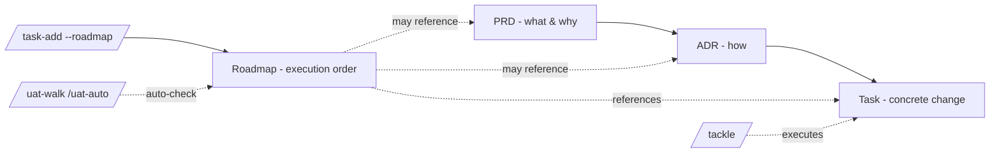

# Roadmaps

This directory is this project's **Roadmap Log** — the collection of every Roadmap written for the project. A **Roadmap** is a structured execution plan that lays out the **order** in which work will be done as a sequenced checklist. Each line is either a link to an existing task file or a free-form inline checkbox item. When a box is checked, the next-up work is immediately obvious.

Roadmaps are managed via three slash commands:

| Command | Purpose |
|---------|---------|
| `/roadmap-create <topic>` | Draft a new roadmap via a short Socratic Q&A — captures goal, phases, and the initial checklist |
| `/roadmap-add <ROADMAP-NNN> <item>` | Append a new item (task link or inline) to an existing roadmap, optionally under a named phase |
| `/roadmap-next <file>` | Read-only — point at the first unchecked item in a roadmap. If it's a task link, suggest `/tackle <path>` |

Roadmaps cross-cut the spec-driven pipeline:

- `/task-add --roadmap ROADMAP-NNN` appends the new task to a roadmap as an unchecked item.
- `/uat-walk`, `/uat-auto`, `/uat-auto-plus`, and `/uat-skip` automatically check off any roadmap items that reference the task being completed.

There is no `/finalize-roadmap` or `/trash-roadmap`. Completion is implicit — once every checkbox is `[x]`, the roadmap has delivered. Editing (reordering, removing items, splitting phases) is ad hoc — open the file and use `Edit`.

---

## Glossary

| Term | Definition |
|------|------------|
| **Roadmap** | A single markdown file containing an ordered, phased checklist that drives execution toward a stated goal |
| **Phase** | A `## Phase N: <name>` block. Phases group items that should complete together before the next phase begins. Order matters |
| **Item** | A single `- [ ] ...` bullet within a phase. May be a **task-link item** (`- [ ] [TASK-NNN: title](../tasks/NNN-slug.md)`) or an **inline item** (`- [ ] Free-form description`) |
| **Task-link item** | A checkbox whose body is a markdown link to a `.docs/tasks/NNN-slug.md` (or `completed/NNN-slug.md`) file. These are auto-checked when the linked task is completed |
| **Inline item** | A checkbox whose body is free-form text — no task file backing it. Must be checked manually (open the file and edit `- [ ]` to `- [x]`) |
| **Hybrid checklist** | A roadmap's mixture of task-link items and inline items. Both forms are valid in the same phase |

---

## When to Write a Roadmap

| Criterion | Check |
|-----------|-------|
| Multiple discrete work units need to happen in a specific order | A single task with steps doesn't need a roadmap — the task file already lists steps |
| Ordering matters and would otherwise be lost in conversation | "Do A before B before C" should be persisted, not re-derived each session |
| You want at-a-glance visibility of remaining work | The roadmap is a single file an agent can read to know "what next" |
| Work spans multiple tasks, multiple PRDs, or multiple sessions | A roadmap is the connective tissue when the surface area exceeds one task |

## When NOT to Write a Roadmap

| Category | Why skip |
|----------|----------|
| Single task with several steps | The task file's `## Steps` checklist already serves this purpose |
| Brainstorming or speculative future work | If items aren't ready to execute, they don't belong in a roadmap — keep them in a PRD's Open Questions or scratch notes |
| Permanent strategy/vision documents | A roadmap is for *execution*; long-term direction belongs in a PRD or README |
| Pure dependency graphs | If the relationship is "X blocks Y and Z, neither blocks each other", a graph or `addBlockedBy` task metadata fits better than a linear roadmap |

---

## Relationship to Other Layers



A roadmap is **orthogonal** to the PRD → ADR → Task pipeline. It does not replace any of them — it stitches their tasks together into an execution order. A roadmap may reference tasks from many PRDs/ADRs, or none at all.

| Layer | Vocabulary | Question it answers |
|-------|------------|---------------------|
| PRD | Outcomes, personas, business value | *What must the product do, for whom, and why?* |
| ADR | Trade-offs, options, technical drivers | *How will we build it?* |
| Task | File paths, function names, steps | *What changes do we make today?* |
| **Roadmap** | **Order, phases, dependencies, progress** | ***In what sequence will we execute the tasks?*** |

---

## File Template

Each roadmap lives at `.docs/roadmaps/NNN-slug.md` (3-digit zero-padded, lowercase-dashed, ≤ 60 chars). The shape:

```markdown
# Roadmap NNN: <Initiative or Goal Title>

> <One-sentence elevator pitch — the destination this roadmap drives toward.>

- **Status**: active | done
- **Created**: YYYY-MM-DD
- **Last updated**: YYYY-MM-DD
- **Owner**: <name or role>
- **Linked PRD**: PRD-NNN (or `—`)
- **Linked ADRs**: ADR-NNNN#DM, ADR-NNNN#DM (or `—`)
- **Tags**: <area-1>, <area-2>

## Goal

<2-3 sentences. What does "done" look like for this roadmap? What state will the system be in when every box is checked?>

## Phase 1: <Phase Name>

> <Optional one-line phase intent.>

- [ ] [TASK-014: Add user table schema](../tasks/014-user-table-schema.md)
- [ ] [TASK-015: Wire migrations](../tasks/015-wire-migrations.md)
- [ ] Confirm staging DB matches prod schema (inline — no task file)

## Phase 2: <Phase Name>

- [ ] [TASK-016: Build /signup endpoint](../tasks/016-signup-endpoint.md)
- [ ] [TASK-017: Build /login endpoint](../tasks/017-login-endpoint.md)

## Phase 3: <Phase Name>

- [ ] Smoke test against staging
- [ ] Cut release branch

## Notes

<Free-form scratchpad — decisions made mid-execution, deferred items, links to discussions. Optional.>
```

**Required, non-empty fields**:

| Field | Why |
|-------|-----|
| Goal | Without it, the roadmap is just a list of chores |
| Owner | Single accountable person for execution |
| At least one Phase with at least one item | An empty roadmap is not a roadmap |

Fields that may legitimately be empty: `Linked PRD`, `Linked ADRs`, `Tags`, `Notes`.

---

## Item Format Rules

### Task-link items (preferred when a task file exists)

```markdown
- [ ] [TASK-NNN: <task title>](../tasks/NNN-slug.md)
```

- The link path is **repo-relative from the roadmap file's location** — typically `../tasks/NNN-slug.md` (or `../tasks/completed/NNN-slug.md` after UAT).
- The visible link text **must** start with `TASK-NNN:` so the auto-checkoff machinery can detect references.
- Auto-checkoff matches links regardless of whether the path points at `.docs/tasks/` or `completed/` — the `TASK-NNN:` prefix plus `<NNN>-<slug>.md` filename is the match key, so a stale directory in the path never blocks the match.
- When a skill that moves a task from `.docs/tasks/` → `completed/` (`/uat-walk`, `/uat-auto`, `/uat-auto-plus`, `/uat-skip`) flips the checkbox, it **must** also rewrite the link path to point at the task's new location in the same step. Stale paths are *not* tolerated — if a reference exists, it gets updated.

### Inline items (free-form)

```markdown
- [ ] <Free-form description of the work — must be checkable manually>
```

- Use inline items for work too small to warrant a task file (e.g. "tag the release", "post to #engineering"), or for placeholders that will be replaced with task links later.
- Inline items are checked manually, or auto-checked by the UAT phase sweep if a completing task is judged to have fulfilled them (see Auto-Checkoff Contract step 7).

### Mixing both in one phase is fine

A phase can interleave task-link items and inline items freely. There is no required ordering between the two forms.

---

## Status

A roadmap has exactly two statuses:

| Status | Meaning | How set |
|--------|---------|---------|
| `active` | At least one unchecked item remains | Default on creation |
| `done` | Every item is `[x]` | Manually flip the `Status:` field when the last box is checked — there is no command for this |

There is no `trashed` or `archived` state — if a roadmap is no longer relevant, delete the file or move it elsewhere by hand. The Roadmap Log is intentionally lightweight.

### Moving a `done` roadmap to `completed/`

Once a roadmap's `Status` is `done`, the file may be moved to `.docs/roadmaps/completed/` to keep the active directory tidy.

**How to move:**

1. Flip `Status: active` → `Status: done` in the file (if not already done).
2. Move the file: `git mv .docs/roadmaps/NNN-slug.md .docs/roadmaps/completed/NNN-slug.md`
3. Update the `File` column in the **Index** below: change `[ROADMAP-NNN](NNN-slug.md)` → `[ROADMAP-NNN](completed/NNN-slug.md)`
4. Update any task links inside the roadmap that used `../tasks/` → already correct if those tasks have been completed; no other path changes are needed within the roadmap file itself.

**What stays the same:**

- The `ROADMAP-NNN` identifier is stable regardless of where the file lives.
- The file remains full history — all auto-checkoff references in task files are unaffected.
- Files in `completed/` are **not** deleted or further edited; they are read-only history by convention.

`/roadmap-next` will suggest this move when it detects that all items are checked.

---

## Index

One row per roadmap. Sort by file number ascending.

| File | Title | Status | Progress | Owner | Linked PRD |
|------|-------|--------|----------|-------|------------|
| [ROADMAP-003](completed/003-openapi-swagger-annotations.md) | OpenAPI/Swagger Annotations | done | 8/8 | David Taylor | — |
| [ROADMAP-004](completed/004-knowledge-graph-coaching-system.md) | Knowledge Graph Coaching System | done | 29/29 | David Taylor | — |
| [ROADMAP-005](005-observability-layer.md) | Observability Layer | active | 9/13 | David Taylor | — |

When adding a row:

| Column | Format |
|--------|--------|
| `File` | `[ROADMAP-NNN](NNN-slug.md)` — update to `[ROADMAP-NNN](completed/NNN-slug.md)` when the file is moved to `completed/` |
| `Title` | The roadmap's H1 sub-title (without the `Roadmap NNN:` prefix) |
| `Status` | `active` \| `done` |
| `Progress` | `<checked>/<total>` counted across all `## Phase N:` sections (e.g. `3/12`) |
| `Owner` | One name or role |
| `Linked PRD` | `PRD-NNN` or `—` |

The index is updated by:

- `/roadmap-create` — appends a new row
- `/roadmap-add` — bumps the `Progress` denominator
- `/uat-walk`, `/uat-auto`, `/uat-auto-plus`, `/uat-skip` — bumps the `Progress` numerator after auto-checkoff

---

## Auto-Checkoff Contract

When a task transitions to **completed** (whether by `/uat-walk`/`/uat-auto`/`/uat-auto-plus` passing all tests, or by `/uat-skip` moving it to `completed/`), those skills **must**:

1. Scan `.docs/roadmaps/*.md` and `.docs/roadmaps/completed/*.md` for any line matching:
   ```
   - [ ] [TASK-NNN: ...]( ... NNN-<slug>.md)
   ```
   where `NNN-<slug>` matches the just-completed task.
2. Flip the matched `- [ ]` to `- [x]` via the `Edit` tool (never `sed`).
3. **If the skill also moved the task file** (any `/uat-*` skill), rewrite the link path in the same matched line so it points at the task's new location (e.g. `../tasks/NNN-slug.md` → `../tasks/completed/NNN-slug.md`). Do this in one `Edit` that combines the checkbox flip and the path rewrite — never leave a stale path behind just because the checkbox is correct.
4. Update the roadmap's `Last updated` field to today.
5. Update the matching row's `Progress` in the index.
6. **Phase sweep — task-link items** — for each roadmap where step 1 found a match, identify the `## Phase N:` block that contained the matched item; scan all other `- [ ] [TASK-NNN:` lines in that same phase; for each, use `mcp__serena__find_file` to check whether `NNN-slug.md` exists under `.docs/tasks/completed/`; if it does, apply a single `Edit` call that both flips `- [ ]` → `- [x]` and rewrites the link path to `../tasks/completed/NNN-slug.md`, then bump `Progress` in the index for each additional item checked.
7. **Phase sweep — inline items** — in the same phase block, collect every remaining `- [ ]` line whose body is free-form text (not a `[TASK-NNN:` link). For each, read the just-completed task file and use judgment to decide whether the task's work fulfilled what the inline item describes. If yes, flip `- [ ]` → `- [x]` via `Edit` and bump `Progress` in the index. If uncertain, leave the item unchecked. Never prompt the user during this sweep — err on the side of leaving items unchecked rather than over-checking.

If no roadmap references the task, the skills do nothing (silent no-op).

If a roadmap's last unchecked box is the one being flipped, the skill **does not** auto-flip `Status: active` → `Status: done` — that flip is intentionally manual so a human confirms the roadmap is truly delivered.

---

## Anti-Patterns to Avoid

| Anti-Pattern | What it looks like | Remedy |
|--------------|-------------------|--------|
| **Roadmap-as-task-file** | The roadmap accumulates step-level detail under each checkbox (`- [ ] Run pnpm install\n  - sub-step: ...`) | Lift sub-detail into a real task file via `/task-add`. The roadmap shows *ordering*, not *implementation*. |
| **Phantom task links** | Roadmap items link to task files that don't exist or never got created | Use `/task-add --roadmap ROADMAP-NNN` so the task is created and linked in one step |
| **Snowballing inline items** | Half the roadmap is inline items because no one bothered to file tasks | If an inline item takes more than a few minutes, file a task and replace it |
| **Two roadmaps tracking the same work** | Duplicate or near-duplicate roadmaps drift out of sync | One roadmap per initiative. If overlap appears, merge or pick one to be canonical |
| **Strategy-doc-in-disguise** | The roadmap is mostly prose about *why*, with one checklist at the bottom | Move the *why* to a PRD. Keep roadmaps execution-focused |
| **Permanent "Phase ∞: Future"** | A trailing phase full of someday/maybe items that never get touched | Either commit to it (real tasks, real ordering) or remove it. Speculation belongs in a PRD's Open Questions |
| **Manual status drift** | `Status: active` left in place after every box is checked | Flip to `done` once verified — the manual gate is intentional, don't ignore it |

---

## See Also

- [`/roadmap-create` skill](../../.claude/skills/roadmap-create/SKILL.md)
- [`/roadmap-add` skill](../../.claude/skills/roadmap-add/SKILL.md)
- [`/roadmap-next` skill](../../.claude/skills/roadmap-next/SKILL.md)
- [Task Index](../tasks/README.md)
- [PRD Log](../prd/README.md)
- [ADR Log](../adr/README.md)
