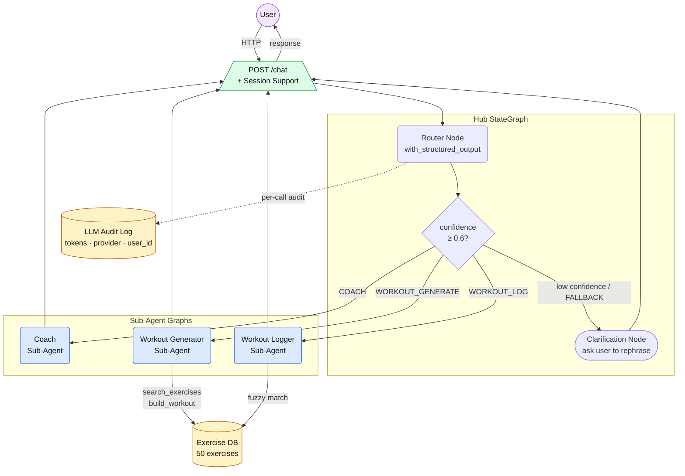

# LangGraph Fitness Coaching Multi-Agent System

> Auto-generated from `.docs/roadmaps/002-langgraph-multi-agent-system.md` by `/mermaid-flowchart`.

## Notes

- The `confidence ≥ 0.6` threshold and FALLBACK intent are documented in the roadmap's Notes section; the exact field name (`confidence`) comes from the router's structured-output schema.
- Both `WorkoutGen` and `WorkoutLog` access `ExerciseDB` — `WorkoutGen` via `search_exercises`/`build_workout` tools, `WorkoutLog` via fuzzy exercise matching to produce structured JSON.
- Return arrows from sub-agents flow back through `ChatAPI` for simplicity; in the actual graph, responses pass back through Hub state before FastAPI serialises them.
- `AuditLog` is drawn as a dotted edge from `Router` because audit entries are written per LLM call (all three sub-agents also write audit rows, but those edges are omitted to avoid clutter).
