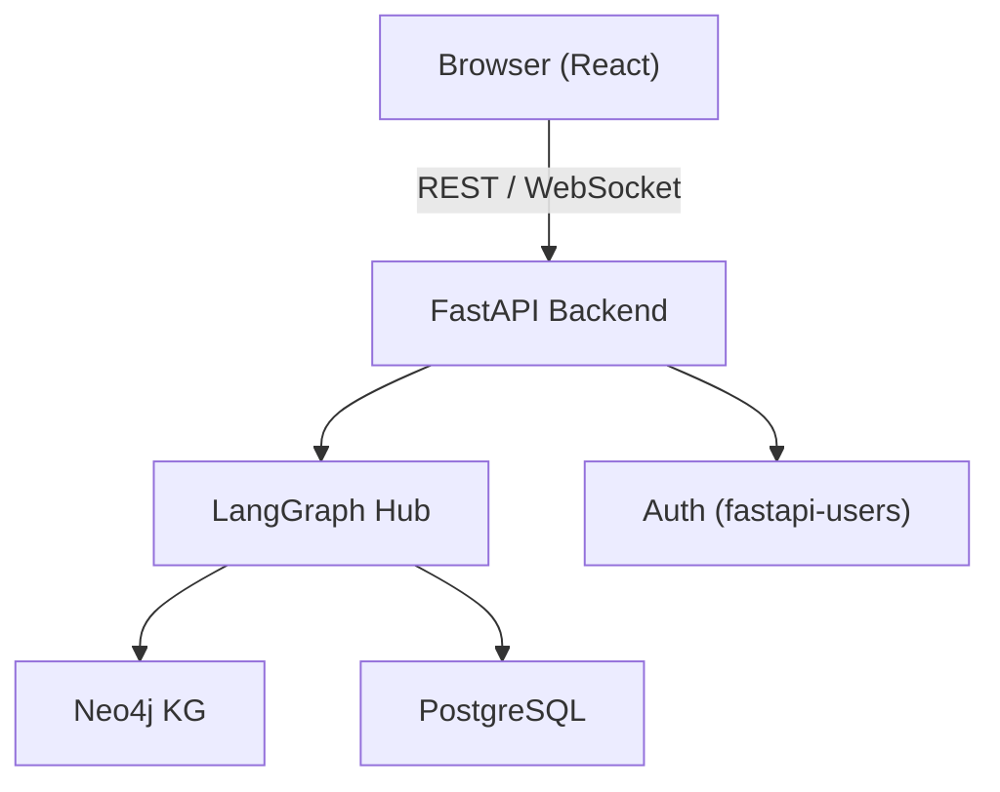
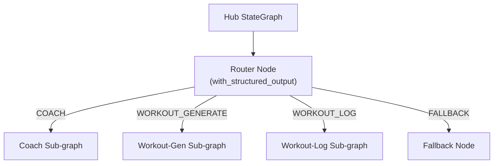
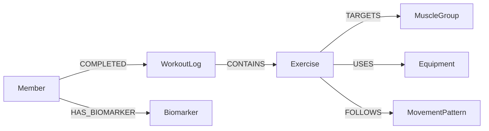

# 102 — Visual Architecture Diagrams (Layered Mermaid, ≤7 nodes each)

> **Depends on**: none
> **Blocks**: none
> **Parallel-safe with**: [071-feedback-submission-ui](071-feedback-submission-ui.md), [084-test-source-type-population](084-test-source-type-population.md)

## Objective

Add three layered Mermaid flowcharts to `README.md` — one per architectural concern — each capped at 7 nodes. GitHub renders `\`\`\`mermaid` blocks natively, so no image files are needed. The candidate-assessment-main spec requires a visual diagram (not ASCII art).

## Approach

Three diagrams replace or augment the existing ASCII architecture block:

1. **System Overview** — user browser → React frontend → FastAPI → (LangGraph agents | Neo4j KG | PostgreSQL)
2. **Agent Topology** — LangGraph hub StateGraph: router node → coach sub-graph | workout-gen sub-graph | workout-log sub-graph
3. **KG Schema** — core Neo4j node types (Member, Exercise, MuscleGroup, MovementPattern, Equipment, WorkoutLog, Concept) with labeled typed edges

Each diagram must have ≤7 nodes. Use `flowchart TD` (top-down) for overview and agent topology; `flowchart LR` (left-right) for KG schema.

The existing ASCII art block (```` ``` ```` fenced block under the architecture heading) should be removed and replaced with the three Mermaid blocks, each preceded by a `###` sub-heading.

## Steps

### 1. Locate the architecture section in README.md  <!-- agent: general-purpose -->

Use `mcp__serena__search_for_pattern` on `README.md` to find the current ASCII architecture block. Record the exact line range so the Edit tool can replace it precisely.

- [ ] Identify the heading (e.g. `## Architecture` or `## System Architecture`) and note its line number
- [ ] Identify the start and end of the existing ASCII/fenced block

### 2. Write the three Mermaid diagrams  <!-- agent: general-purpose -->

Replace the located block with the following content (adjust exact labels if the current README uses different names, but keep node count ≤7 per diagram):

````markdown
## Architecture

### System Overview



### Agent Topology



### Knowledge Graph Schema


````

- [ ] Replace old ASCII block with the three sub-sections above
- [ ] Verify node count: System Overview = 6 nodes ✓, Agent Topology = 6 nodes ✓, KG Schema = 6 nodes ✓
- [ ] Ensure no `\`\`\`` fencing errors (triple-backtick inside the file must be verbatim, not escaped)

### 3. Verify README renders correctly  <!-- agent: general-purpose -->

- [ ] Confirm `README.md` is valid Markdown (no unclosed fences, no stray characters)
- [ ] Confirm the three `\`\`\`mermaid` blocks are present and each has a closing `\`\`\``
- [ ] Confirm no node appears more than once per diagram
- [ ] Confirm each diagram has ≤7 nodes

## Acceptance Criteria

- [ ] `README.md` contains exactly three `\`\`\`mermaid` code blocks under `## Architecture` (or equivalent heading)
- [ ] Each diagram has ≤7 nodes
- [ ] The old ASCII/plain-text architecture block is removed
- [ ] GitHub-compatible Mermaid syntax (flowchart TD / LR, no unsupported features)
- [ ] Sub-headings label each diagram clearly (System Overview, Agent Topology, Knowledge Graph Schema)

---
**UAT**: [`.docs/uat/102-visual-architecture-diagrams.uat.md`](../uat/102-visual-architecture-diagrams.uat.md)
