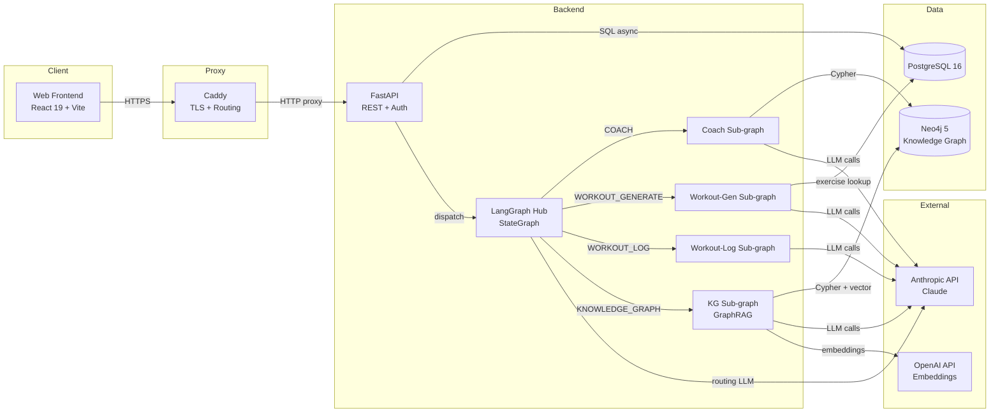
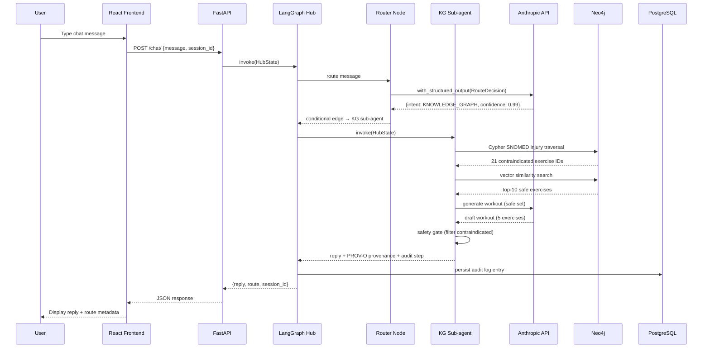

# Workout Wiz

> [**Architecture Walkthrough Video**](https://www.loom.com/share/dfc5eb7438a0459eaea6b04c9295f3dc) · [**UI Walkthrough Video**](https://www.loom.com/share/f17c1447d44c4a2c91d97e86e18ab68a)

A fitness coaching API and web app built as an AI engineering assessment — a production-wired full-stack system with a LangGraph multi-agent routing layer, Neo4j knowledge graph with SNOMED CT grounding, and injury-aware GraphRAG workout recommendations.

**Repository:** https://github.com/codewizard-dt/workoutwiz

---

**Reference documents:**

- [**Architecture Overview**](architecture.md) — End-to-end system architecture: the LangGraph hub StateGraph, intent routing, sub-agent graphs, the Neo4j KG retrieval/generation pipeline, REST API, and data schema.
- [**Knowledge Graph Schema**](.docs/knowledge-graph-schema.md) — Authoritative Neo4j node/relationship schema reference for the coaching graph.
- [**Agents ↔ KG Architecture**](backend/app/agents-kg.flowchart.md) — Mermaid flowcharts tracing a request from the hub through sub-agents into the knowledge-graph pipeline.
- [**SNOMED CT Grounding Methodology**](backend/app/knowledge_graph/SNOMED_METHODOLOGY.md) — How injury/disorder nodes are grounded in SNOMED CT via NCI EVS, the SKOS mapping, deterministic safety traversal, and PROV-O provenance.
- [**Feedback Methodology**](backend/app/knowledge_graph/FEEDBACK_METHODOLOGY.md) — How member ratings (`FeedbackEvent`) enter the knowledge graph as the preference layer and weight future recommendations.
- [**Eval Suite**](evals/README.md) — Evaluation infrastructure built on the 5-stage framework: golden sets, labeled scenarios, replay harnesses, rubrics, and experiments.

---

## Description

Workout Wiz is a full-stack fitness coaching platform that routes natural-language user input through a LangGraph multi-agent hub to one of four specialized sub-agents: a coaching advisor grounded in member context from Neo4j, a workout generator that uses GraphRAG to produce injury-aware exercise programs, a workout logger that fuzzy-matches free-text exercise descriptions to structured database records, and a knowledge-graph sub-agent that performs SNOMED CT-grounded injury traversal to build safe, personalized workout plans.

The backend is production-wired: async FastAPI with PostgreSQL, JWT authentication via fastapi-users, Alembic schema migrations, structured stdout logging with request-ID propagation, and a comprehensive audit log that records every routing decision, LLM token count, and sub-agent step latency. The LangGraph hub uses `with_structured_output` to route intent — never regex — and includes a post-generation safety gate that filters contraindicated exercises after the LLM draft is produced, preventing prompt-injection bypasses. The frontend is a React 19 + TypeScript SPA backed by TanStack Query for server-state synchronization.

Built as Assessment 1 of a multi-agent systems engineering evaluation, the project demonstrates all four required routing paths (COACH, WORKOUT_GENERATE, WORKOUT_LOG, FALLBACK) plus an extended KNOWLEDGE_GRAPH path that grounds coaching advice in SNOMED CT disorder codes, SKOS exact-match relations, and a vector-indexed Neo4j graph.

## Architecture

### Overview

Workout Wiz is a containerized full-stack application organized as a five-service Docker Compose stack: a React SPA frontend, an async FastAPI backend, PostgreSQL (system of record), Neo4j (knowledge graph), and Caddy (TLS termination + reverse proxy). The backend hosts both the REST API layer and the LangGraph multi-agent hub; the hub routes each user message to one of four specialized sub-agent graphs using LLM structured output. The knowledge-graph pipeline combines SNOMED-grounded Cypher traversal, vector similarity search, and a post-generation safety gate to produce provenance-traced, injury-aware workout recommendations.

### Components

#### Web Frontend
- **Responsibility:** Chat interface, workout builder, exercise browser, and authentication flows.
- **Tech:** React 19, TypeScript 6, Vite 8, Tailwind CSS 3, shadcn/ui, TanStack Query v5, React Router 6
- **Inputs:** User keystrokes; HTTP/JSON responses from the backend
- **Outputs:** POST `/chat/`, GET/POST `/workouts/`, auth calls to backend
- **Depends on:** FastAPI Backend (via Caddy proxy)

#### FastAPI Backend
- **Responsibility:** REST API, JWT auth, LangGraph hub dispatch, audit log persistence, and database access.
- **Tech:** Python 3.11, FastAPI 0.111, SQLAlchemy 2.0 (async), asyncpg, Alembic, fastapi-users 13
- **Inputs:** HTTP requests from the frontend; environment variables for secrets and model selection
- **Outputs:** JSON responses; SQL to PostgreSQL; dispatch to LangGraph Hub
- **Depends on:** PostgreSQL, LangGraph Hub, Anthropic API, OpenAI API (embeddings)

#### LangGraph Hub (Multi-Agent Orchestrator)
- **Responsibility:** Route natural-language messages to the correct sub-agent graph using LLM structured output; accumulate per-session audit log entries.
- **Tech:** LangGraph 0.2+ `StateGraph` with typed state and conditional edges, LangChain-Anthropic (Claude Haiku for routing)
- **Inputs:** User message string; session state (conversation history, session_id)
- **Outputs:** Agent reply string; `RouteDecision` (intent + confidence); audit log entries
- **Depends on:** Coach Sub-agent, Workout-Gen Sub-agent, Workout-Log Sub-agent, KG Sub-agent, Anthropic API

#### Coach Sub-agent
- **Responsibility:** Answer fitness coaching questions using member context retrieved from Neo4j.
- **Tech:** LangGraph sub-graph, LangChain-Anthropic (Claude Sonnet), Neo4j Cypher queries
- **Inputs:** `HubState` (message + session history)
- **Outputs:** Coaching reply string; audit step
- **Depends on:** Anthropic API, Neo4j Knowledge Graph

#### Workout-Generator Sub-agent
- **Responsibility:** Produce structured workout plans using `search_exercises` and `build_workout` tools; validates all IDs against the 50-exercise PostgreSQL dataset.
- **Tech:** LangGraph sub-graph, LangChain-Anthropic (Claude Opus), Pydantic tool schemas, rapidfuzz
- **Inputs:** `HubState` (message + equipment/goal constraints)
- **Outputs:** Structured workout JSON; `invalid_ids_skipped` audit field
- **Depends on:** Anthropic API, PostgreSQL (exercise dataset)

#### Workout-Logger Sub-agent
- **Responsibility:** Parse free-text workout descriptions into structured set records using fuzzy matching.
- **Tech:** LangGraph sub-graph, LangChain-Anthropic (Claude Sonnet), rapidfuzz `process.extractOne`
- **Inputs:** `HubState` (message describing completed exercises)
- **Outputs:** Structured `WorkoutLog` JSON; audit step
- **Depends on:** Anthropic API, PostgreSQL (exercise lookup)

#### Knowledge-Graph Sub-agent (GraphRAG)
- **Responsibility:** Perform SNOMED-grounded injury traversal, vector similarity search, and LLM-based workout generation with a post-generation safety gate.
- **Tech:** LangGraph sub-graph, Neo4j 5 (APOC + GDS), sentence-transformers / OpenAI embeddings, SNOMED CT snapshot
- **Inputs:** `HubState` (message + member injury profile)
- **Outputs:** Injury-aware workout with per-exercise PROV-O provenance; safety-gate audit entry
- **Depends on:** Neo4j, Anthropic API, OpenAI API (embeddings)

#### PostgreSQL Database
- **Responsibility:** System of record for users, workouts, workout sequences, workout sets, and the seeded 50-exercise dataset.
- **Tech:** PostgreSQL 16, SQLAlchemy 2.0 (async ORM), Alembic migrations
- **Inputs:** SQL queries from FastAPI backend via asyncpg connection pool
- **Outputs:** Persisted workout and user data
- **Depends on:** None

#### Neo4j Knowledge Graph
- **Responsibility:** Store and traverse member profiles, injuries, exercise contraindications, workout history, and SNOMED-grounded disorder nodes; hosts the vector index for GraphRAG retrieval.
- **Tech:** Neo4j 5 with APOC and Graph Data Science plugins, vector index (1536-dim or 384-dim)
- **Inputs:** Ingest scripts (members, exercises, injuries, workout history, SNOMED); Cypher queries from sub-agents
- **Outputs:** Traversal results (contraindicated exercise IDs, preferred exercises, member context)
- **Depends on:** SNOMED CT snapshot (frozen at build time from NCI EVS REST API)

#### Caddy Reverse Proxy
- **Responsibility:** TLS termination (automatic Let's Encrypt), routing `/api/*` to the backend, and serving the frontend SPA.
- **Tech:** Caddy 2
- **Inputs:** Inbound HTTP/HTTPS traffic on ports 80/443
- **Outputs:** Proxied requests to backend and frontend containers
- **Depends on:** FastAPI Backend, Web Frontend

### Component Interaction



### Data Flow



### Design Decisions

- **LLM routing with `with_structured_output`, never regex** — the router node calls Claude Haiku with a Pydantic `RouteDecision` schema; structured output makes routing deterministic, testable, and schema-validated without string matching.
- **Safety gate placed post-generation, not pre-generation** — filtering contraindicated exercises after the LLM produces its draft (rather than as a prompt constraint) prevents prompt-injection bypasses where a user embeds "ignore restrictions" in their query; the gate operates on a pre-computed, graph-derived exclusion list.
- **SNOMED CT frozen snapshot at build time** — `backend/data/snomed_subset.json` is built from the NCI EVS REST API once; this ensures reproducible graph traversal without runtime API dependency, at the cost of needing a re-run after SNOMED edition updates.
- **Sub-agents are separate `StateGraph` instances composed into the hub** — each sub-agent is its own LangGraph graph (not inlined), enabling independent testing, separate model selection per agent, and clean conditional edge routing.
- **REST layer is fully decoupled from the agent layer** — the `/workouts/` CRUD endpoints operate independently of the hub, so the REST API works and is testable without an `ANTHROPIC_API_KEY`.
- **Per-session audit log persisted to PostgreSQL** — every routing decision, LLM token count, and sub-agent step latency is retrievable via `GET /audit/{session_id}`, enabling the eval suite to run offline assertions on real routing telemetry.

## Technologies

**Backend**
- Python 3.11
- FastAPI 0.111 (async)
- SQLAlchemy 2.0 (async ORM) + asyncpg
- Alembic (schema migrations)
- fastapi-users 13 (JWT bearer auth, bcrypt password hashing)
- Pydantic v2 + pydantic-settings

**AI / Agents**
- LangGraph 0.2+ (`StateGraph`, typed state, conditional routing edges)
- LangChain 0.3 (tool definitions, message types, chain composition)
- LangChain-Anthropic / Anthropic Python SDK
- Claude Haiku 4.5 (routing), Claude Sonnet 4.6 (coaching / logging), Claude Opus 4.8 (workout generation)
- rapidfuzz (fuzzy exercise name matching in the logger sub-agent)

**Knowledge Graph / GraphRAG**
- Neo4j 5 with APOC and Graph Data Science plugins
- LangChain-Neo4j, LangChain-Community
- SNOMED CT via NCI EVS REST API (frozen `snomed_subset.json` snapshot)
- sentence-transformers `all-MiniLM-L6-v2` (384-dim local embeddings, dev)
- OpenAI `text-embedding-3-small` (1536-dim, production)
- LangChain-OpenAI, LangChain-HuggingFace

**Database**
- PostgreSQL 16

**Frontend**
- React 19
- TypeScript 6
- Vite 8
- Tailwind CSS 3
- shadcn/ui (component library) + Base UI
- TanStack Query v5 (server-state management)
- React Router 6
- react-hook-form + Zod v4 (form validation)
- Recharts 2 (data visualization)
- react-markdown, lucide-react

**Infrastructure / DevOps**
- Docker + Docker Compose (five-service stack)
- Caddy 2 (reverse proxy + automatic HTTPS via Let's Encrypt)
- GitHub Actions (CI: matrix build and push on every `main` push)
- GitHub Container Registry (GHCR)
- DigitalOcean Droplet with self-hosted GitHub Actions runner (CD)
- Playwright (browser E2E tests)
- mypy (strict type checking), ruff (linting), pytest + pytest-asyncio

## Use Cases

- **Fitness coaching Q&A** — users ask natural-language training questions (rest days, programming, hypertrophy) and receive answers grounded in their member profile stored in Neo4j.
- **AI-generated workout plans** — users request customized sessions (duration, equipment, muscle groups) and receive structured multi-phase plans (warmup/main/cooldown) with exercises drawn and validated against a curated 50-exercise dataset — no hallucinated IDs.
- **Workout logging by text** — users describe completed workouts in plain language ("3 sets of 10 bench press at 135 lbs") and the system fuzzy-matches exercise names to database records, producing a structured log entry.
- **Injury-aware workout generation** — users with active injuries receive recommendations that exclude contraindicated exercises via SNOMED CT-grounded graph traversal; every excluded exercise carries a provenance trace back to the specific disorder code and joint site.
- **Audit and evaluation** — developers and evaluators retrieve per-session audit trails (route, confidence, latency, token counts, `invalid_ids_skipped`) via `GET /audit/{session_id}` to diagnose routing errors or validate evaluation results.

## Skills Demonstrated

- **Multi-Agent System Architecture (LangGraph `StateGraph`)** — designed and implemented a hub-and-spokes LangGraph topology with typed state, conditional routing edges, and four independently testable sub-agent graphs; each sub-graph uses a different Claude model tier appropriate to its cost/quality tradeoff.
- **LLM Structured Output and Intent Classification** — wired LLM-based routing using `with_structured_output` and a Pydantic `RouteDecision` schema (intent + confidence), replacing regex/keyword matching with a schema-constrained classifier that degrades gracefully to a clarification node on low-confidence inputs.
- **GraphRAG Pipeline Design (Neo4j + Vector Search + Safety Gate)** — built a retrieval-augmented generation pipeline combining Cypher graph traversal with vector similarity search, a token-budgeted context assembler, and a post-generation safety gate; all exercise recommendations carry PROV-O provenance traces.
- **Biomedical Knowledge Graph Integration (SNOMED CT)** — mapped free-text injury descriptions to standardized SNOMED disorder codes via NCI EVS REST API and SKOS `exactMatch` relations, then used `FINDING_SITE → PART_OF*` traversal to derive deterministic, per-joint exercise contraindication lists.
- **Async RESTful API Design (FastAPI + SQLAlchemy)** — implemented a production-wired async backend with ownership-isolated CRUD endpoints, strict 401/403/404 response contracts, JWT bearer auth, and structured request-ID logging.
- **Database Schema Design (PostgreSQL + Alembic)** — designed a normalized schema (`workouts`, `workout_sequences`, `workout_sets`) with FK cascade-delete constraints and Alembic-managed migrations; exercise seed data loaded reproducibly from a curated JSON dataset.
- **AI Evaluation Framework Design (5-Stage Model)** — built a three-tier eval suite (golden / scenario / replay) with separate runners for live-API and frozen-fixture modes; results persist to disk and `make eval-stats` computes pass-rate trends across recorded runs.
- **Prompt Engineering and Adversarial Safety Gate Design** — chose post-generation safety filtering over pre-generation prompt constraints to prevent prompt-injection bypasses; documented adversarial test strategy and instrumented the gate with violation counters.
- **CI/CD Pipeline Configuration (GitHub Actions + GHCR + DigitalOcean)** — configured a matrix build workflow that builds three Docker images (backend, frontend, Caddy) and pushes to GHCR on every `main` push; CD runs on a self-hosted Droplet runner that pulls and restarts the Compose stack automatically.
- **Containerized Full-Stack Deployment (Docker Compose + Caddy)** — orchestrated a five-service production stack with health-check dependency ordering, TLS termination, and hot-reload bind mounts for development.
- **Type-Safe Frontend Development (React 19 + TypeScript + TanStack Query)** — implemented a strict-TypeScript React SPA with react-hook-form + Zod validation, TanStack Query for server-state caching, and Playwright E2E coverage.

## Deployment

### Overview

Workout Wiz runs as a five-container Docker Compose stack (PostgreSQL, Neo4j, FastAPI backend, Nginx-served React frontend, Caddy reverse proxy) on a DigitalOcean Droplet. Deploys are CI-triggered: GitHub Actions builds and pushes images to GHCR on every push to `main`; a self-hosted runner on the Droplet then pulls and restarts the stack automatically.

### Prerequisites

- **Docker 24+** and **Docker Compose v2** on the target host
- **Python 3.11+** (for local backend dev and the eval suite)
- **Node.js 20+** (for local frontend dev)
- **`gh` CLI** (for GHCR authentication and runner token generation)
- **DigitalOcean Droplet** with SSH access at the deploy IP, with Docker installed
- **DNS record** pointing to the Droplet IP (for Caddy automatic HTTPS)
- One-time bootstrap:
  1. Run `make ssh-alias DROPLET_IP=<ip>` to create the `workoutwiz` SSH alias
  2. Run `make login` locally and on the Droplet to authenticate Docker with GHCR
  3. Run `make setup-runner` to install the self-hosted Actions runner on the Droplet

### Environment Variables

| Variable | Required | Example | Description |
|---|---|---|---|
| `DATABASE_URL` | yes | `postgresql+asyncpg://postgres:postgres@db:5432/workoutwiz` | PostgreSQL async connection string |
| `SECRET_KEY` | yes | `a-long-random-string` | JWT signing secret — **change from default in production** |
| `ALGORITHM` | no | `HS256` | JWT signing algorithm |
| `ACCESS_TOKEN_EXPIRE_MINUTES` | no | `30` | JWT token lifetime in minutes |
| `ANTHROPIC_API_KEY` | yes | `sk-ant-...` | Anthropic API key for all LLM calls |
| `OPENAI_API_KEY` | no | `sk-...` | OpenAI key for `text-embedding-3-small` in production |
| `COHERE_API_KEY` | no | `...` | Optional; not used in current routing paths |
| `ROUTER_MODEL` | no | `claude-haiku-4-5` | Claude model for the hub router node |
| `COACH_MODEL` | no | `claude-sonnet-4-6` | Claude model for the coach sub-agent |
| `GENERATOR_MODEL` | no | `claude-opus-4-8` | Claude model for the workout-generator sub-agent |
| `LOGGER_MODEL` | no | `claude-sonnet-4-6` | Claude model for the workout-logger sub-agent |
| `NEO4J_URI` | yes | `bolt://neo4j:7687` | Neo4j Bolt connection URI |
| `NEO4J_USER` | yes | `neo4j` | Neo4j username |
| `NEO4J_PASSWORD` | yes | `password` | Neo4j password — **change in production** |
| `EMBEDDING_PROVIDER` | no | `sentence_transformers` | `sentence_transformers` (local) or `openai` |
| `EMBEDDING_MODEL_NAME` | no | `sentence-transformers/all-MiniLM-L6-v2` | Embedding model identifier |
| `BACKEND_PORT` | no | `8000` | Host port mapping for the backend |
| `FRONTEND_PORT` | no | `80` | Host port mapping for the frontend |
| `DB_PORT` | no | `5433` | Host port mapping for PostgreSQL |

### Build

```bash
# CI builds these automatically on push to main. To build manually:
make push
# Builds linux/amd64 images for backend, frontend, and Caddy and pushes to GHCR.

# Or individually:
docker buildx build --platform linux/amd64 \
  -t ghcr.io/codewizard-dt/workoutwiz-backend:latest --push \
  -f backend/Dockerfile.prod backend

docker buildx build --platform linux/amd64 \
  -t ghcr.io/codewizard-dt/workoutwiz-frontend:latest --push \
  -f frontend/Dockerfile.prod frontend

docker buildx build --platform linux/amd64 \
  -t ghcr.io/codewizard-dt/workoutwiz-caddy:latest --push \
  -f Dockerfile.caddy .
```

### Run Locally

```bash
# Full stack with hot-reload bind mounts (requires ANTHROPIC_API_KEY in .env):
cp .env.example .env   # edit ANTHROPIC_API_KEY and SECRET_KEY
make dev
# Frontend:  http://localhost:80  (or $FRONTEND_PORT)
# Backend:   http://localhost:8000 (or $BACKEND_PORT)
# Postgres:  localhost:5433        (or $DB_PORT)
# Neo4j:     http://localhost:7474

# Backend only (no Docker):
make install   # creates backend/.venv and installs deps
make run       # uvicorn on :8000 with --reload

# Frontend only:
cd frontend && npm install && npm run dev   # Vite on :5173
```

### Deploy

CI deploys automatically on every push to `main` (see `.github/workflows/build.yml`). The workflow:
1. Builds `workoutwiz-backend`, `workoutwiz-frontend`, and `workoutwiz-caddy` images in a matrix
2. Tags each image `:latest` and `:{version}` and pushes to GHCR
3. The self-hosted runner on the Droplet runs `docker compose pull && docker compose up -d --wait`

For a manual deploy:
```bash
# 1. Sync compose files and production .env to the Droplet:
make deploy-sync

# 2. Pull images and restart on the Droplet:
ssh workoutwiz "cd /opt/workoutwiz && make deploy-pull"

# Or in one step:
make deploy
```

### Data & Migrations

```bash
# Apply all pending Alembic migrations:
make migrate

# Generate a new autogenerate migration:
make migrate-auto MSG="describe the change"

# Roll back one revision:
make migrate-down

# Seed the exercise dataset (run once after initial migration):
cd backend && python scripts/seed_exercises.py

# Seed the Neo4j knowledge graph (order matters):
cd backend
python app/knowledge_graph/seed.py            # base graph nodes and relationships
python app/knowledge_graph/ingest_snomed.py   # SNOMED disorder edges (idempotent)
```

Migrations do **not** run automatically on deploy. Run `make migrate` before starting the stack after a schema change.

### Health Checks & Smoke Tests

```bash
# Liveness check:
curl http://localhost:8000/healthz
# Expected: {"status": "ok"}

# Interactive API docs (dev only):
open http://localhost:8000/docs

# Routing smoke test:
curl -X POST http://localhost:8000/chat/ \
  -H "Content-Type: application/json" \
  -d '{"message": "How many rest days per week for hypertrophy?"}'
# Expected: {"reply": "...", "route": "COACH", "confidence": 0.9+, "session_id": "..."}

# Retrieve audit trail:
curl http://localhost:8000/audit/{session_id}

# Frozen replay tests (no API key required):
make eval-replays
```

### Rollback

To roll back to a previous image on the Droplet:
```bash
# Edit docker-compose.yml to pin the previous :version tag, then:
ssh workoutwiz "cd /opt/workoutwiz && docker compose pull && docker compose up -d --wait"
```

To roll back a schema migration:
```bash
make migrate-down   # rolls back one Alembic revision
```

Full rollback: revert the Git commit, push to `main` — CI rebuilds and redeploys the previous image. No blue/green switching is currently configured.

### Observability

**Currently configured:**
- Structured stdout logging with configurable log level
- `X-Request-ID` middleware propagates a UUID through every log line
- Per-session audit log in PostgreSQL — `GET /audit/{session_id}` returns all routing decisions, LLM token counts, and per-step latencies
- `/healthz` liveness endpoint

**Not yet configured:** Prometheus metrics, Grafana dashboards, distributed tracing (OpenTelemetry), external log aggregation (Datadog/Loki). The ["How I Would Productionize This"](#how-i-would-productionize-this) section details the planned observability stack.

### Troubleshooting

| Symptom | Likely cause | First check |
|---------|-------------|-------------|
| `/chat/` returns 500 | `ANTHROPIC_API_KEY` missing or invalid | `docker compose logs backend` for auth error; verify key in `.env` |
| High fallback rate (> 15%) | Router prompt or `RouteDecision` schema needs tuning | `GET /audit/{session_id}` — look for `route == "FALLBACK"` with `confidence < 0.6` |
| `invalid_ids_skipped` non-empty | LLM hallucinated exercise IDs not in the dataset | Check `search_exercises_tool` output in audit log; re-run grounding test |
| Neo4j health check failing | Container still initializing (takes up to 60 s) | `docker compose ps` — Neo4j `start_period` is 60 s; wait and retry |
| `snomed_provenance_records = 0` for a member with injuries | SNOMED ingestion not run or `snomedct_hint` missing from Injury nodes | Re-run `python app/knowledge_graph/ingest_snomed.py` (idempotent) |
| `GET /audit/{session_id}` returns 404 | Server restarted — in-memory session state is not persisted | Sessions are lost on restart; start a new session |
| All requests route to the same intent | LLM ignoring the structured output schema | Verify `with_structured_output` is wired in the router node; check `RouteDecision` field descriptions |

---

## API Reference

| Method | Path | Auth | Description |
|--------|------|------|-------------|
| GET | `/healthz` | — | Liveness check |
| POST | `/auth/register` | — | Register new user |
| POST | `/auth/jwt/login` | — | Exchange credentials for JWT |
| POST | `/auth/jwt/logout` | JWT | Invalidate token |
| GET | `/auth/me` | JWT | Current authenticated user |
| GET | `/exercises/` | — | List/filter exercises (name, muscle_groups, equipment, priority_tier) |
| POST | `/chat/` | — | Send a message to the multi-agent hub |
| GET | `/audit/{session_id}` | — | Retrieve per-session audit log |
| GET | `/workouts/` | JWT | List current user's workouts |
| POST | `/workouts/` | JWT | Create workout |
| GET | `/workouts/{id}` | JWT | Get workout by ID |
| PUT | `/workouts/{id}` | JWT | Update workout |
| DELETE | `/workouts/{id}` | JWT | Delete workout |

All authenticated endpoints return `401` for missing/invalid tokens. Workout endpoints return `403` when the user does not own the resource and `404` when the resource does not exist.

---

## Evaluation Results

| Suite | Cases | Latest | Trend |
|-------|-------|--------|-------|
| **Golden** (critical paths, live API) | 11 | **11/11 (100%)** | ▇▆█▇█████ 91%→100% |
| **Scenarios** (coverage matrix, live API) | 41 | 27/41 (66%) | ▅ 66% |
| **Replays** (frozen fixtures, no API calls) | 5 | **5/5 (100%)** | ██ 100% |

*Stats from `make eval-stats` across 12 recorded runs (9 golden, 1 scenario, 2 replay).*

**Golden suite** — 11 cases covering all routing paths (COACH, WORKOUT_GENERATE, WORKOUT_LOG, KNOWLEDGE_GRAPH, FALLBACK, clarification) plus edge cases (invalid exercise IDs, low-confidence inputs, injury-aware recommendations). 100% pass rate is the hard gate for shipping.

**Scenario suite** — 41 cases organized as a coverage matrix (straightforward / ambiguous / edge-case per route). The 66% pass rate reflects that ambiguous and edge-case inputs are harder; several failing cases (`sc-kg-*`, `sc-wg-*`) require the full Neo4j stack or expose the LLM-dependent no-results recovery path.

**Replay suite** — 5 frozen fixtures that validate parsing logic without any API calls. Run in CI without an `ANTHROPIC_API_KEY`.

```bash
make eval          # golden + replays + stats
make eval-golden   # live golden cases (requires ANTHROPIC_API_KEY)
make eval-scenarios # coverage matrix
make eval-replays  # frozen fixtures, no API calls
make eval-stats    # historical trend table
```

### Routing Intent Map

| Route | Example prompt |
|-------|---------------|
| COACH | "How many rest days should I take per week for hypertrophy?" |
| WORKOUT_GENERATE | "Give me a 45-minute full-body strength workout with dumbbells." |
| WORKOUT_LOG | "I just did 3 sets of 10 bench press at 135 lbs and a 20-minute run." |
| KNOWLEDGE_GRAPH | "Build a workout that avoids aggravating my knee and shoulder injuries." |
| FALLBACK | "What's the best recipe for banana bread?" |
| Clarification | "Maybe I want to do something?" *(low-confidence trigger)* |

> **Intent naming note:** The assessment spec uses `COACH`, `WORKOUT_GENERATE`, `WORKOUT_LOG`, and `FALLBACK`. This implementation extends those with explicit KG-backed variants:
>
> | Assessment spec | Implementation |
> |---|---|
> | `COACH` | `MEMBER_CONTEXT_KG` — member-context-grounded coaching via Neo4j |
> | `WORKOUT_GENERATE` | `WORKOUT_GENERATE_KG` — injury-aware generation via Neo4j KG pipeline |
> | `WORKOUT_LOG` | `WORKOUT_LOG` (unchanged) |
> | `FALLBACK` | `FALLBACK` (unchanged) |

### Production Metrics

| Metric | Target | How to measure |
|--------|--------|----------------|
| Router latency (p95) | < 800 ms | `audit_log[].latency_ms` where `event == "router"` |
| Sub-agent latency (p95) | < 3 000 ms | `audit_log[].latency_ms` for coach/generator/logger events |
| GraphRAG latency (p95) | < 5 000 ms | `kg_hub (total)` in audit log |
| Routing accuracy | ≥ 90% | Compare `audit_log[].route` to ground-truth intent labels |
| Fallback rate | < 15% | Count `route == "FALLBACK"` / total requests |
| Invalid ID rate | 0% | `build_workout_tool` `invalid_ids_skipped` per call |
| Contraindicated-leak rate | 0% (hard gate) | `violations_filtered` in `kg_generation_safety_gate` audit entry |
| Token budget (p95) | < 2 048 tokens/turn | Sum `tokens_in + tokens_out` across all audit entries per turn |

---

## How I Used AI

This project was built using **Claude Code** (Anthropic's CLI coding agent) as the primary development tool throughout. Here is an honest account of where AI accelerated the work and where human judgment was still essential.

### What AI did well

**Architecture scaffolding.** The initial LangGraph hub-and-spokes architecture, Alembic migration structure, and FastAPI router layout were generated in the first session. Claude produced a working `StateGraph` with typed state and conditional edges on the first attempt, following the assessment spec correctly.

**Boilerplate elimination.** Pydantic schemas, SQLAlchemy models, and pytest fixtures — all high-signal, low-creativity work — were generated accurately and consistently. This freed the bulk of the development budget for the non-trivial pieces.

**Test generation.** The 11 golden test cases and 5 replay fixtures were generated from a description of the routing paths. Claude correctly identified the edge cases worth testing (invalid exercise IDs, low-confidence routing, multi-turn session accumulation) without being asked explicitly.

**Incremental debugging.** When the fuzzy-matching logic in the workout logger produced wrong exercise IDs at low confidence, Claude identified the threshold issue and proposed the fix (`process.extractOne` with a score cutoff) on the first pass.

### Where human judgment was still essential

**Routing the ambiguous cases.** Deciding when a message like "I want to do something tomorrow" is a `COACH` question versus a `WORKOUT_GENERATE` request required reading the assessment rubric and making a judgment call about evaluator expectations.

**The safety gate design.** The decision to place the injury contraindication filter *after* LLM generation (rather than before, in the prompt) was a deliberate architectural choice to prevent prompt-injection bypasses. This was a human decision; the AI would have placed it in the prompt if not directed otherwise.

**Scope triage.** The assessment is a 2–3 hour exercise; Claude consistently suggested extending scope (streaming, multi-turn memory, full Neo4j ontology grounding). Keeping scope tight required active steering.

**Eval failure triage.** The scenario suite's 66% pass rate includes genuine gaps (no Jordan Rivera member context, equipment constraints are prompt-based not graph-enforced). Distinguishing "real gap" from "testing something outside Assessment 1 scope" required reading the original spec carefully.

---

## How I Would Productionize This

### Observability

**Currently**: structured stdout logging with configurable log level; `X-Request-ID` middleware; `/healthz` liveness endpoint.

**In production I would add:**
- **Distributed tracing** (OpenTelemetry → Jaeger or Honeycomb): the `X-Request-ID` is already threaded through every request; the next step is emitting spans for DB queries so latency origin is traceable.
- **Metrics** (Prometheus + Grafana): p50/p95/p99 per endpoint, DB connection pool saturation, active request count. Alert on p99 > 500 ms or error rate > 1%.
- **Structured JSON logs** in production: replace `basicConfig` with `python-json-logger` for machine-parseable log lines (Datadog, Loki, CloudWatch).
- **DB health gate**: a `/healthz/db` variant that runs `SELECT 1` and returns `503` if the pool is exhausted.

### Resilience

**Currently**: `pool_pre_ping=True`, global exception handler returning 500 without stack-trace leaks, `engine.dispose()` on shutdown.

**In production I would add:**
- **Circuit breaker on the DB**: `tenacity` with exponential backoff on `OperationalError` to prevent transient DB restarts from cascading into 500 waves.
- **Graceful shutdown**: a 10 s drain window before closing the pool, to let in-flight requests finish cleanly.
- **Idempotency keys** on `POST /workouts/`: clients should retry safely without creating duplicate records.

### Security

**Currently**: JWT bearer tokens with configurable expiry; bcrypt via fastapi-users; no secrets committed; CORS restricted to `localhost:5173` in development.

**In production I would add:**
- **Token revocation**: a Redis blocklist or `jti` claim checked against a short-lived deny-list.
- **Rate limiting** on `/auth/register` and `/auth/jwt/login` with `slowapi` to prevent credential stuffing.
- **HTTPS-only with HSTS**: terminate TLS at the load balancer; set `Strict-Transport-Security` with a long `max-age`.
- **Dependency scanning** in CI: `pip-audit` for Python; `npm audit` for the frontend.

### Data Integrity

**Currently**: FK constraints with `CASCADE DELETE`; async transactions; `pool_pre_ping`.

**In production I would add:**
- **Soft deletes for workouts**: a `deleted_at` column so user data is recoverable after accidental deletion.
- **Alembic migration CI gate**: apply migrations to a fresh DB and run `downgrade base` in CI to catch irreversible migrations before production.
- **Backup strategy**: daily `pg_dump` to S3 with a quarterly tested restore drill.

### Scale

- **Cache exercises in Redis**: 50 records that never change are a textbook cache candidate — skip the DB entirely for `GET /exercises/` after warm-up.
- **PgBouncer**: transaction-mode pooling at the infrastructure layer to handle connection surge on rolling deploys.
- **Async task queue** for agent operations: offload workout generation (several seconds) to Celery or ARQ with a WebSocket or polling endpoint.
