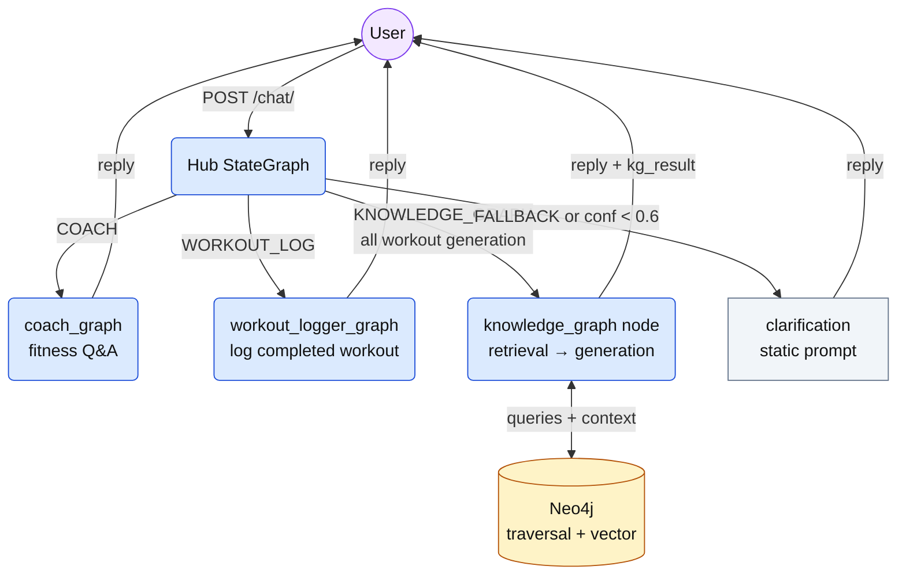
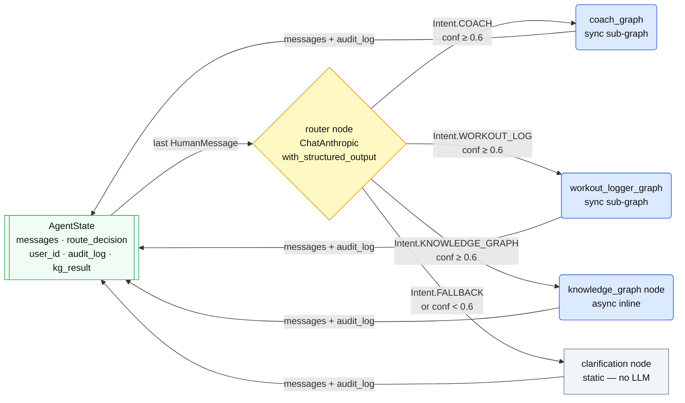
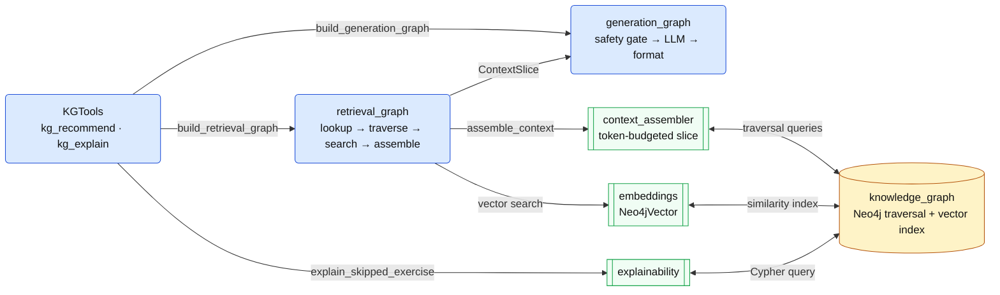

# Agents ↔ KG Architecture

> See `backend/app/agents/GRAPH_STRUCTURE.md` for the full node/edge/state reference.

---

## 1 — High-Level Request Flow

How a message travels from the user through the hub, into the appropriate sub-agent, and returns a response.

---

## 2 — Hub Internals

Routing logic: the router LLM classifies intent into `RouteDecision{intent, confidence, reasoning}`. `_route_selector()` maps that to a node key; confidence < 0.6 always diverts to clarification regardless of intent.

---

## 3 — KG Internals

How the KG package works on its own. Two entry points: the hub's `kg_node` (direct) and `KGTools` (via API router).

---

## Notes

- **Single agents→KG touchpoint**: `hub.kg_node` calls `build_retrieval_graph(driver)` directly — it is the only import crossing the package boundary from `app/agents` into `app/kg`.
- **KGTools is a parallel entry point**: `app/kg/tools.py` exposes `kg_recommend_tool` and `kg_explain_tool` as LangChain tools callable from the FastAPI router, but the hub does not bind them.
- **FeedbackService is router-only**: `feedback_service.write_feedback` is called from the `/kg/feedback` FastAPI endpoint, not from any LangGraph node — omitted from chart 3 for clarity.
- **GenerationGraph receives context via state**: `retrieval_graph` assembles a `ContextSlice` and passes it through `RetrievalState`; `generation_graph` reads it from there — no direct function call between the two graphs.
